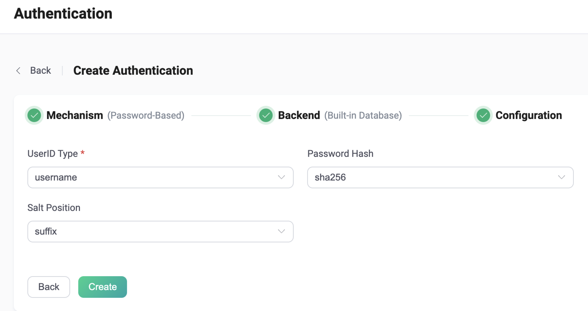

# Use Built-in Database

You can use the built-in database of EMQX as a low-cost and out-of-the-box option for password authentication. After enabling, EMQX will save the client credentials in its built-in database (based on Mnesia) and manages data via REST API and Dashboard. This chapter will introduce how to use EMQX Dashboard and configuration items to configure. 

::: tip

- Knowledge about [basic EMQX authentication concepts](../authn/authn.md)

:::

## Configure with Dashboard

You can use EMQX Dashboard to set the built-in database for password authentication. 

On [EMQX Dashboard](http://127.0.0.1:18083/#/authentication), click **Access Control** -> **Authentication** on the left navigation tree to enter the **Authentication** page. Click **Create** at the top right corner, then click to select **Password-Based** as **Mechanism**, and **Built-in Database** as **Backend**, this will lead us to the **Configuration** tab, as shown below. 




**UserID Type**: Specify the fields for client ID authentication; Options:  `username`, `clientid`（corresponding to the  `Username` or `Client Identifier` fields in the `CONNECT` message sent by the MQTT client).

**Password Hash**: Select the Hash function for storing the password in the database, for example, plain, md5, sha, bcrypt, pbkdf2. There are some extra items to be configured based on the function you selected: 

1. If **plain**, **md5**, **sha**, **sha256** or **sha512** are selected, we also need to configure:
   - **Salt Position**: Specify the way (**suffix**, **prefix**, or **disable**) to add salt (random data) to the password. You can keep the default value unless you are migrating user credentials from external storage into EMQX built-in database. Note: If you choose **plain**, the **Salt Position** should be set to **disable**.  
2. If **bcrypt** is selected, we also need to configure:

   - **Salt Rounds**: Specify the calculation times of Hush function (2^Salt Rounds). Default value: **10**; Value range **4~31**. You are recommended to use a higher value for better protection. Note: Increasing the cost factor by 1 doubles the necessary time. 
3. If **pkbdf2** is selected, we also need to configure: 

   - **Pseudorandom Function**: Specify the Hush function for generating the key, for example,  sha256. 
   - **Iteration Count**: Specify the calculation times of Hush function. Default: **4096**.
   - **Derived Key Length** (optional): Specify the generated key length. You can leave this field blank, then the key length will be determined by the pseudorandom function you selected. 

Now we can click **Create** to finish the setting. 

## Configure with Configuration Items

You can also configuration items for the configuration. <!--For detailed steps, see [authn-builtin_db:authentication](../../configuration/configuration-manual.md#authn-builtin_db:authentication).-->

Example:

```hocon
{
   backend = "built_in_database"
   mechanism = "password_based"
   password_hash_algorithm {
      name = "sha256",
      salt_position = "suffix"
   }
   user_id_type = "username"
}
```


## Migrate from external storage to EMQX built-in database

To migrate user credentials from external storage to EMQX built-in database, you can use .csv or .json files for batch import. For operating details, see [Import User](./user_management.md#importing-users).
