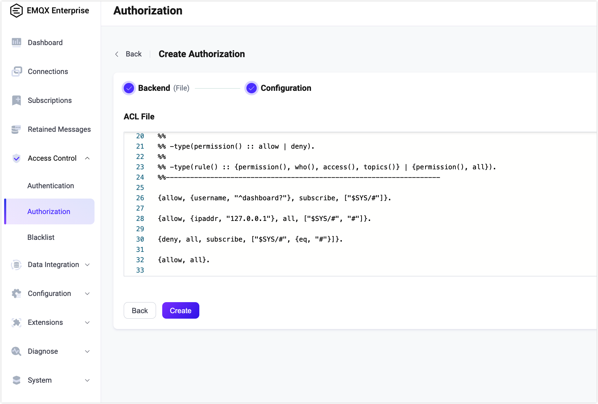

# Use ACL file

This authorizer implements ACL checks through matching pub/sub requests against a predefined list of rules configured in
a file.

::: tip Prerequisite
Starting from 5.0, file-based ACL rules can be edited and reloaded from EMQX dashboard UI.
:::

File-based ACL is simple and lightweight. It is suitable to configure generic rules. For hundreds or more per-client rules, it is recommended to use other authorization sources, and file-based ACL can be the safety guard put at the end of the authorization chain.

## Configure with Dashboard

On [EMQX Dashboard](http://127.0.0.1:18083/#/authentication), click **Access Control** -> **Authorization** on the left navigation tree to enter the **Authorization** page. Click **Create** at the top right corner, select **File** as **Backend**, and click **Next**. The **Configuration** tab is shown as below. 



## Configuration

The file-based authorizer is identified by type `file`.

Sample configuration:

```
authorization {
  deny_action = ignore
  no_match = allow
  sources = [
    {
      type = file
      enable = true
      path = "etc/acl.conf"
    }
  ]
}
```

::: tip
The initial file provided by the `path` config is not mutable to EMQX.
If rules are updated from the dashboard UI or management API, the new rules
will be stored in `data/authz/acl.conf`, and this original config will no longer be loaded.
:::

## ACL file format

ACL configuration file is a list of Erlang [tuples](https://www.erlang.org/doc/reference_manual/data_types.html#tuple) ending with a period. 

- A _tuple_ is a comma-separated list of expressions. The whole list is enclosed in curly braces.
- There must be a period at the end of each rule.
- The `%` prefix identifies comment strings.

Example:

```erlang
%% Allow MQTT client using username "dashboard"  to subscribe to "$SYS/#" topics
{allow, {user, "dashboard"}, subscribe, ["$SYS/#"]}.

%% Allow users with IP address "127.0.0.1" to publish/subscribe to topics "$SYS/#", "#"
{allow, {ipaddr, "127.0.0.1"}, pubsub, ["$SYS/#", "#"]}.

%% Deny "All Users" subscribe to "$SYS/#" "#" Topics
{deny, all, subscribe, ["$SYS/#", {eq, "#"}]}.

%% Allow any other publish/subscribe operation
{allow, all}.
```

The rules are matched from top to bottom. If a rule matches, its permission is applied, and the remaining rules are ignored.

- The first position in a tuple indicates the permission applied if the rule is successfully hit. The possible values are:
    * `allow`
    * `deny`
- The second position of a tuple describes clients for which the rule takes effect. The following terms and their combinations can be used to specify the clients:
    * `{username, "dashboard"}` — clients with username `dashboard`.
    * `{username, {re, "^dash"}}` — clients with username matching the [regular expression](https://www.erlang.org/doc/man/re.html#regexp_syntax) `^dash`.
    * `{user, ...}` — the same as `{username, ...}`.
    * `{clientid, "dashboard"}` — clients with clientid `dashboard`.
    * `{clientid, {re, "^dash"}}` — clients with clientid matching the [regular expression](https://www.erlang.org/doc/man/re.html#regexp_syntax) `^dash`.
    * `{client, ...}` — the same as `{clientid, ...}`.
    * `{ipaddr, "127.0.0.1"}` — clients connecting from IP address `127.0.0.1`. Netmasks are allowed. If EMQX is behind a TCP proxy, `proxy_protocol` should be enabled for the client's MQTT listener.
    * `{ipaddrs, ["127.0.0.1", ..., ]}` — clients connecting from one of the specified IP addresses `127.0.0.1, ..., `. Netmasks are allowed.
    * `all` — any clients.
    * `{'and', [Spec1, Spec2, ...]}` — clients satisfying _all_ of the specifications from the list.
    * `{'or', [Spec1, Spec2, ...]}` — clients satisfying _any_ of the specifications from the list.
- The third position of the tuple indicates the operation for which the rule is applicable.
    * `publish` — the rule applies to publish operations.
    * `subscribe` — the rule applies to subscribe operations.
    * `all` — the rule applies to both publish and subscribe operations.
- The fourth position of the tuple specifies the topics to which the rule applies. The topics are specified with a list op _patterns_. The following patterns are available:
    * A string value, like `"$SYS/#"`. It is a standard topic filter allowing wildcards. Topic filters match topics according to the [MQTT specification rules](http://docs.oasis-open.org/mqtt/mqtt/v3.1.1/errata01/os/mqtt-v3.1.1-errata01-os-complete.html#_Toc442180920). For example, `$SYS/#` matches topics `$SYS/foo`, `$SYS/foo/bar` for publish and topics
    `$SYS/foo`, `$SYS/foo/#`, and `$SYS/#` for subscribe. Topic [placeholders](./authz.md#topic-placeholders) are
    also available.
    * An `eq` tuple, like `{eq, "foo/#"}`. It indicates full equivalence of topic characters. This pattern matches exactly `foo/#` topic for all operations. Wildcards or placeholders are not taken into account, i.e., topic `foo/bar` is not matched.

Additionally, there are two special rules:
    - `{allow, all}` — allow all operations.
    - `{deny, all}` — deny all operations.

These rules are usually used as default at the end of the configuration.
