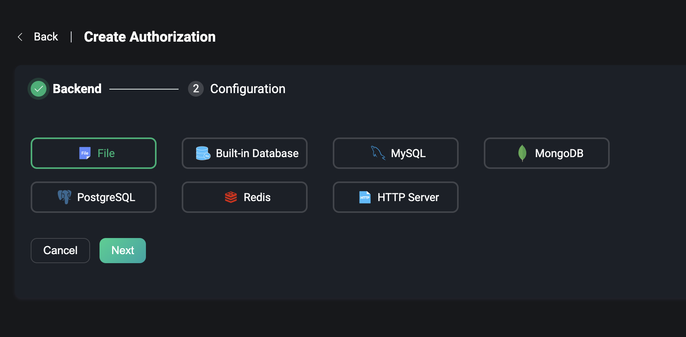
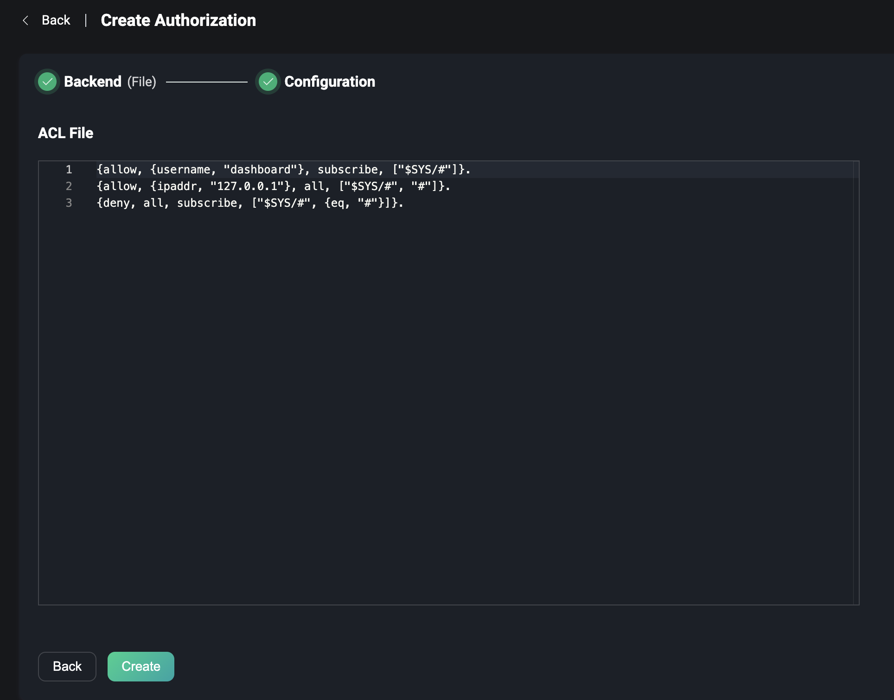
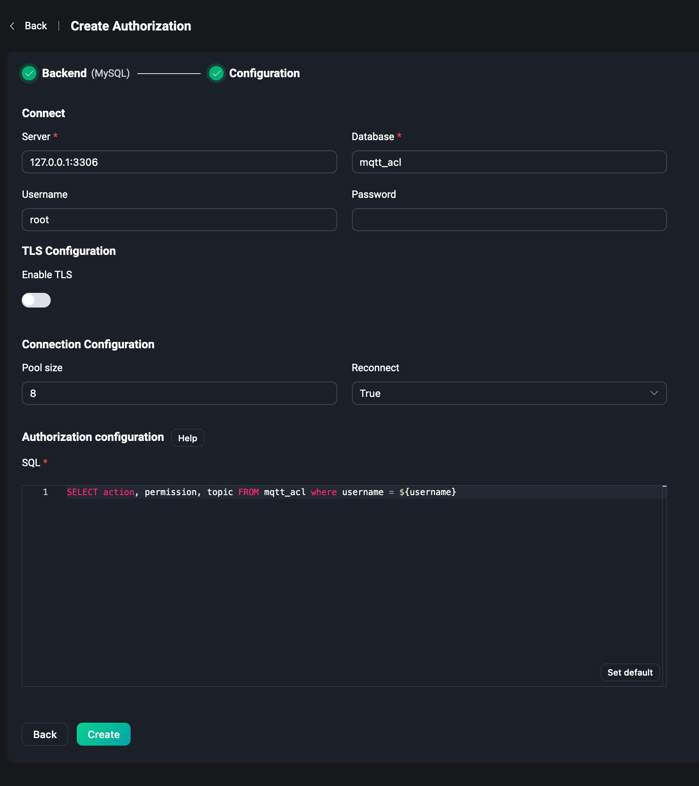
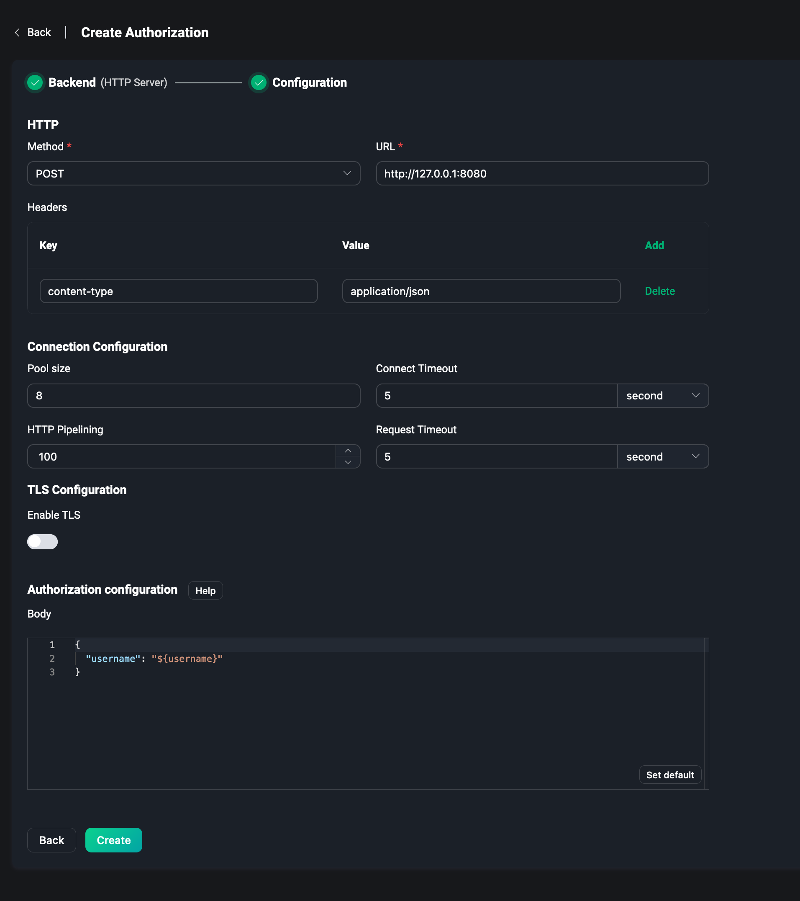
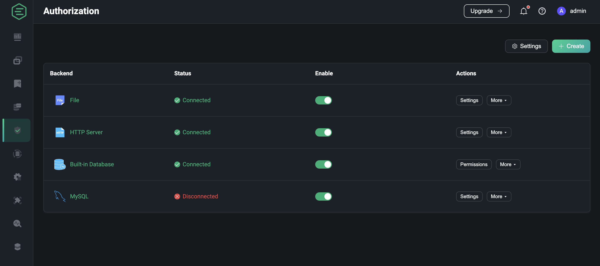
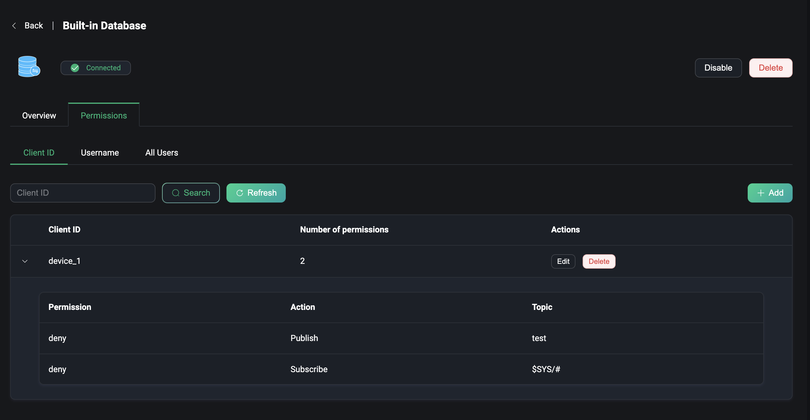
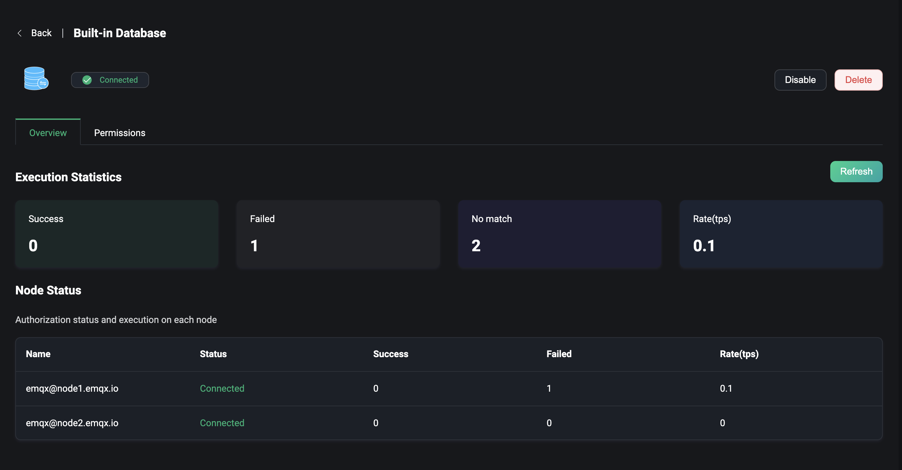
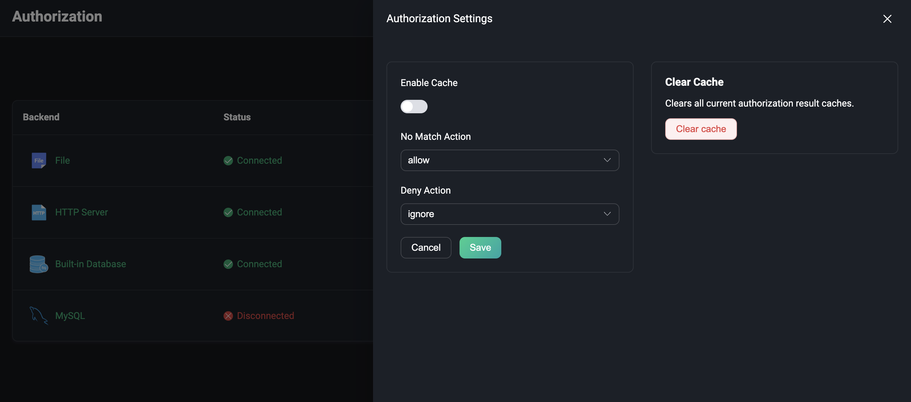

# Authorization

EMQX provides powerful permission control capabilities, and EMQX Dashboard provides out-of-the-box authorization management capabilities to quickly configure EMQX authorization mechanisms through visual pages without writing code or manually editing configuration files, enabling permission control for publish and subscribe operations after MQTT client connection, enabling security configuration at all levels and in all scenarios.

Under the Access Control menu on the left, users can access the Authorization page, where they can quickly create and manage the various types of authorized configuration resources that have been created.

## Create

In the upper right corner under the Authorization page, click the `Create` button to go to the Authorization page. Creating an authorization requires selecting a backend to configure and store permission data.

### Backend

The backend contains the option to use File, Built-in databases, external databases or HTTP Server.

Use ACL File to edit and save authorized content by scanning a set of rules defined in the file for each publish or subscribe request to determine if the request has permission to perform the desired action.

Use the EMQX built-in database, which can also be used to configure and store authorization rules.

Use an external database to store authorization rules, supporting a selection of mainstream databases including: `MySQL`, `PostgreSQL`, `MongoDB`, `Redis`, etc.

Delegate authorized requests to an external HTTP server using a pre-defined HTTP service. The external HTTP service needs to include the ability to validate permissions.

### Configuration

After selecting the backend it is time to create the final step of authorization, configure the selected backend. Each backend has some configuration for connection or use that needs to be configured manually by the user, or the content of the rules can be edited and saved in an ACL file.

#### File

Using the ACL file, a text edit box is provided on the configuration parameters page to edit the content of the file's authorization rules, which is a list of Erlang tuple data. (Note that each rule must be followed by a dot .) A tuple is a list wrapped in brackets, with the elements separated by commas.

For more details about how to edit the contents of file rules, please visit [File](../security/authz/file.md).

#### Built-in Database

For using the built-in database for authorization, there is no need to configure parameters, and just configure permission rules in the users page after successful creation.

#### External Database

If you use an external database, you need to configure the address of the database you can access, the database name, the username and password, and fill in the SQL statements or other query statements on how to get the authorization data from the database. When publishing and subscribing, the authorization data will be queried from the database to determine whether the permission rules can be passed. Take MySQL as an example:

For more details on configuring MySQL or other external databases, please visit [MySQL](../security/authz/mysql.md) or see using other databases.

#### HTTP Server

To use the HTTP Server, we need to first have an HTTP server that is preconfigured to support authorization data matching. When subscribing and publishing, EMQX forwards the data to the HTTP service and determines, by the results returned by HTTP, whether the operation can pass the permission rules.

So we need to configure the address and method of requesting the service including POST or GET method, request the Headers of the service, configure the authorization information needed for publishing the subscription into the `Body` field, e.g. `username`, `topic` and `action` into the JSON data.

For more details about how to configure HTTP Server authorization, please visit [HTTP](../security/authz/http.md).

After completing the configuration, click `Create` to quickly complete the authorization configuration. Note: You cannot select the used authorization backend again.

## List

When the authorization is created, we can view and manage it in the authorization list. For example, if the external database is not deployed successfully and connected, you can see that the backend status is currently disconnected. If you hover over the field, you can see more status of all nodes in the EMQX cluster connected to that backend. Click the Enabled switch to quickly enable and disable this authorization.

The authorization list is similar to the authentication list in that each column can be reordered by dragging with the mouse, or the list can be reordered via the action column, as EMQX allows multiple authorization mechanisms to be created, Configured authorizers form a global chain. When a client makes a publish/subscribe request, authorizers are sequentially used to find access lists for the client. If an authorizer finds authorization rules, the request is checked against them and gets allowed/denied. If authorization rules are not found, then the next authorizer from the chain is used.

In the actions bar you can also click to settings or delete the authorization, etc.

## Users

For users using the built-in database, click `Users` on the authorization list page to get to the users page, where you can manage and configure authorization rules. You can distinguish clients by `Client ID` or `Username`, or add authorization rules for all users.

To use it, enter a topic for which you need to configure authorization rules, and choose whether to configure its permissions to allow or deny when subscribing to this topic or when publishing payload to this topic.

For more details about how to configure the authorization of the built-in database, please visit [Built-in Database](../security/authz/mnesia.md).

## Overview

Clicking on the backend of the list page takes you to the overview page for that authorization. This page provides some metrics data related to authorization in the EMQX cluster, such as the number of successes and failures of authorization at runtime, the number of mismatches and the current rate, etc.

The node status at the bottom of the page allows you to view the authorization metrics data under each node from the list.

## Settings

When you need to modify the backend of authorization, you can click `Settings` in the list page, and you can modify the configuration in the settings page, such as when you need to modify the content of the permission rules of ACL file, or when some connection information of the external database occurs or the query statement is changed.

## Global Settings

Click the `Settings` button in the upper right corner of the list page to configure the authorization globally.

Set the action when the authorization does not match, allow or deny, and whether to ignore the message or disconnect. Whether to enable the cache of authorization data, when it is enabled, it can reduce the access pressure on the authorization data backend. Click `Clear Cache` on the right side to quickly clear all current authorization result caches.

For more details about Authorization, please visit [Authorization Introduction](../security/authz/authz.md).
