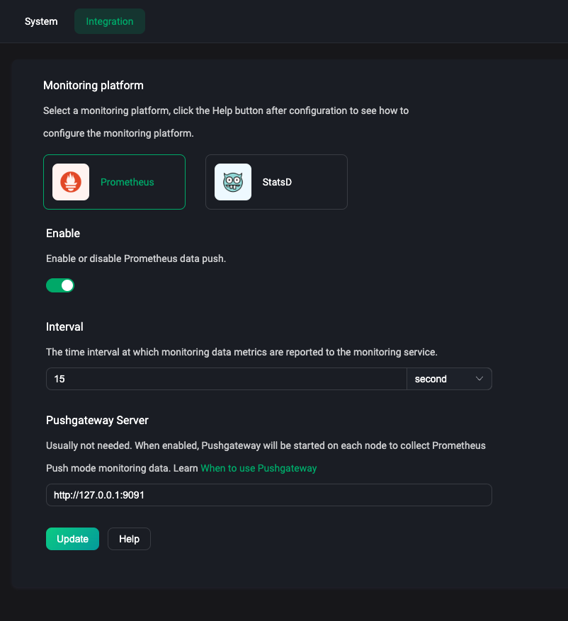

# Configuration

EMQX provides hot configuration capabilities, which can dynamically modify the configuration at runtime without restarting the EMQX node. In the Dashboard page, we provide a visual configuration page for the hot configuration function, which can easily modify the configuration of EMQX. The following configuration items are currently provided:

- Listener
- MQTT
- Log
- Monitoring Integration

## Listener

Clicking on the listener under the configuration menu on the left will take you to the listener page, which is a list page of a listener by default. EMQX provides four common listeners by default:

- TCP listener using port 1883
- SSL/TLS secure connection listener using port 8883
- WebSocket listener using port 8083
- WebSocket secure listener using port 8084

We normally use the above default listeners, enter the corresponding port and protocol type. If you need to add other types of listeners, you can click the `Add Listener` button in the upper right corner to add a new listener.

### Add Listener

Click add listener button, you can see a form for adding a listener on the right panel. The form contains the basic configuration items of the listener. Enter a listener name to identify the listener, select a listener type, including tcp, ssl, ws, and wss types, enter the listener bind, you can enter the IP address and port number, using the IP address can limit the access range of the listener, or you can directly enter a port number, and then click the `Add` button.

More about the listener configuration, please refer to [Listener Configuration](../admin/cfg.md#brokerlisteners).

### Manager Listener

After adding a listener, you can see the listener in the list, click the `Settings` button to modify the configuration of the listener. Note: the listener name, type and bind cannot be modified again in the settings. Click the `Delete` button to delete the listener. When deleting the listener, you need to enter the name of the listener you are currently deleting to confirm the deletion operation. In the list, we can also click the enable switch to enable or disable the listener. The number of connections under each listener can also be viewed in the list.

::: warning
Modify and delete listeners are operations with a certain degree of risk, which need to be operated with caution. If you update or delete a listener, the client connections on that listener will be disconnected.
:::

## MQTT

Click the MQTT under the configuration menu on the left to go to the MQTT configuration page. In the MQTT configuration page, we can configure the MQTT configuration items, including:

### General

General menu is the general basic configuration items of the MQTT protocol, including similar configuration idle timeout, maximum packet size, maximum Client ID length, topic level and QoS, etc.

### Session

Session menu is the session related configuration items of the MQTT protocol, including session expiration interval (only supported by non-MQTT 5.0 connections, MQTT 5.0 connections need to be configured in the client), maximum subscription quantity, maximum flight window, whether to store QoS 0 messages, etc.

### Retainer

Retainer menu is the MQTT protocol related configuration items of the retained message, including the maximum number of retained messages, the storage type, etc. You can also view the retained messages in EMQX, view the topic, QoS, which client ID it comes from, the publish time, and click to view the specific Payload content, etc.

### Advanced

Advanced menu is the advanced configuration items of the MQTT protocol, including the configuration of the system topic $SYS, including the message publishing period, heartbeat period, etc. Topic rewrite, you can manually add the topic, action, original topic and target topic that needs to be rewritten. Proxy subscription, add the built-in rules of the proxy subscription. Finally, you can set the delayed publishing function.

More about the MQTT configuration, please refer to [MQTT Configuration](../admin/cfg.md#brokermqtt).

## Log

Click the log under the configuration menu on the left to go to the log configuration page. The log configuration is divided into two parts, one is the Console Handler, and the other is the File Handler. In the log configuration page, you can set whether to enable the log handler, set the log level, the log formatter, text or json, and the log file can also set the path and name.

More about the log configuration, please refer to [Log Configuration](../admin/cfg.md#log).

## Monitoring Integration

Click the monitoring integration under the configuration menu on the left to go to the monitoring integration configuration page. This page mainly provides integration configuration with third-party monitoring platforms. Currently, EMQX provides integration with Prometheus and StatsD. The configuration page can quickly enable this configuration and configure the URL of push gateway server and data reporting interval, etc.

::: tip
Note: There is a component with two options in the configuration page, you can enter a custom value, or you can select one of the provided fixed options, and only one of the two ways can be used.
:::
