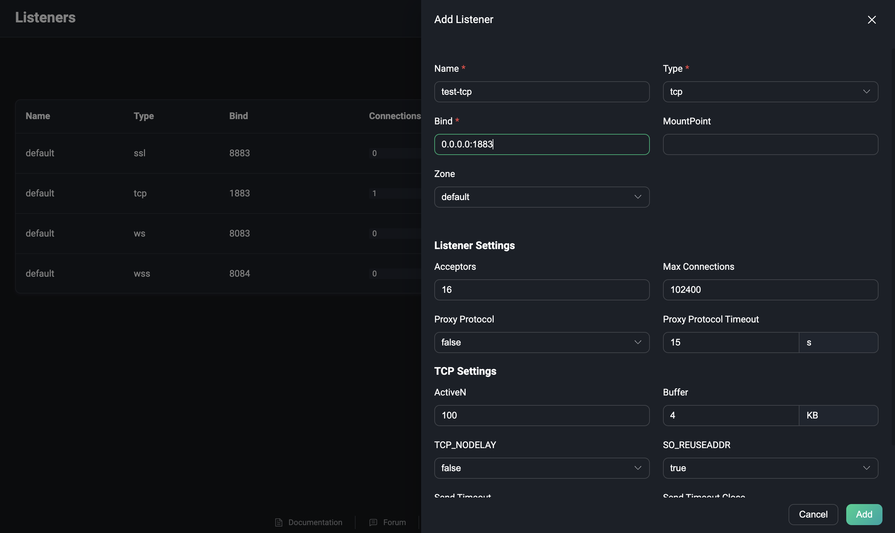
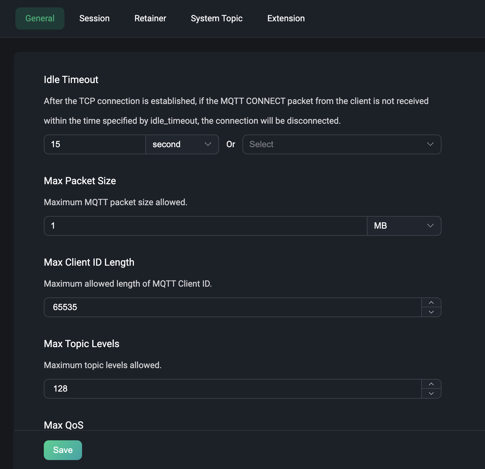
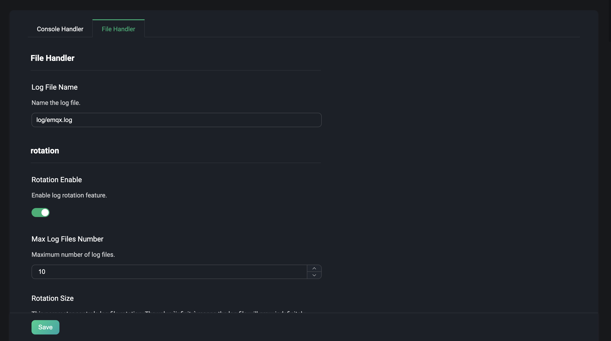
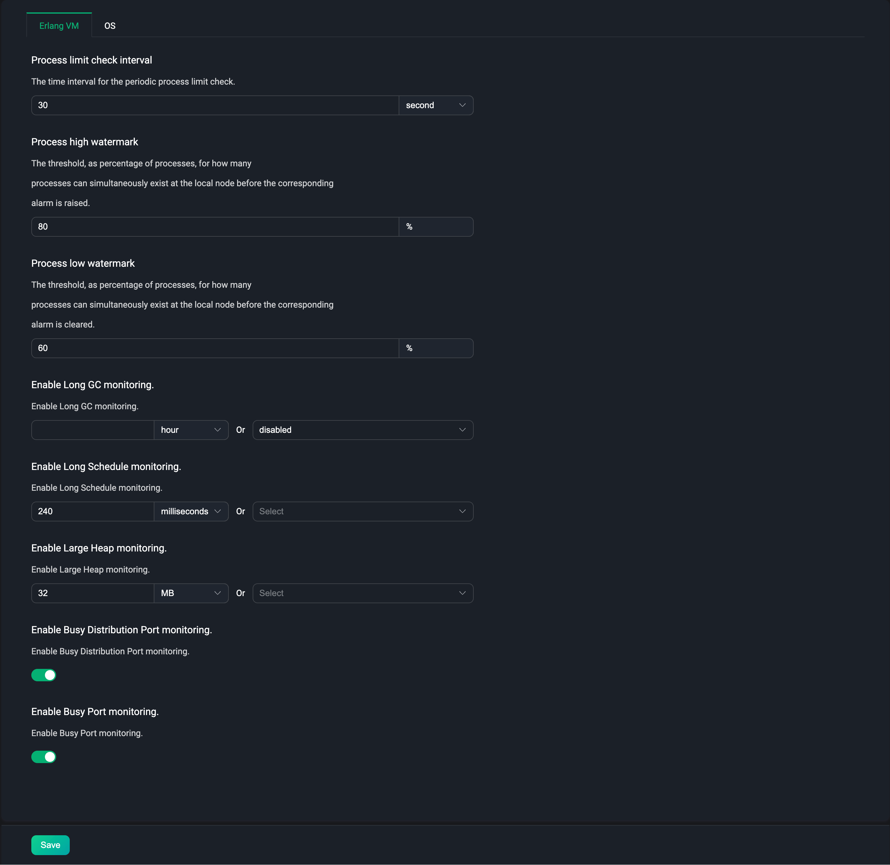
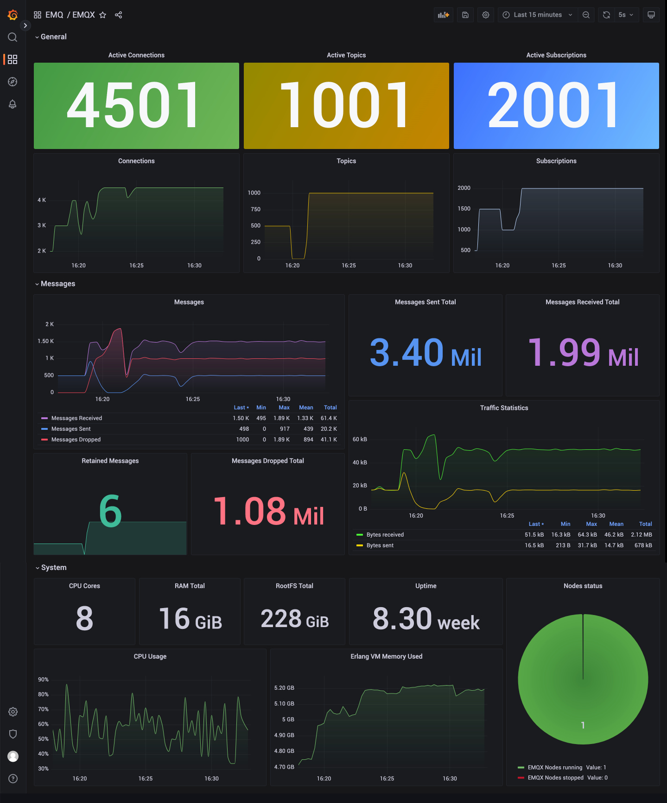

# Configuration

EMQX provides hot configuration capabilities, which can dynamically modify the configuration at runtime without restarting the EMQX node. In the Dashboard page, we provide a visual configuration page for the hot configuration function, which can easily modify the configuration of EMQX. The following configuration items are currently provided:

- Listener
- MQTT
- Log
- Monitoring Integration

## Listener

Clicking on the listener under the configuration menu on the left will take you to the listener page, which is a list page of a listener by default. EMQX provides four common listeners by default:

- TCP listener using port 1883
- SSL/TLS secure connection listener using port 8883
- WebSocket listener using port 8083
- WebSocket secure listener using port 8084

We normally use the above default listeners, enter the corresponding port and protocol type. If you need to add other types of listeners, you can click the `Add Listener` button in the upper right corner to add a new listener.

### Add Listener

Click add listener button, you can see a form for adding a listener on the right panel. The form contains the basic configuration items of the listener. Enter a listener name to identify the listener, select a listener type, including tcp, ssl, ws, and wss types, enter the listener bind, you can enter the IP address and port number, using the IP address can limit the access range of the listener, or you can directly enter a port number, and then click the `Add` button.

More about the listener configuration, please refer to [Listener Configuration](../configuration/configuration-manual.md#brokerlisteners).

### Manager Listener

After adding a listener, it can be seen in the list, and the name can be clicked to enter the edit page. On this page, the listener's configuration can be modified, or the listener can be deleted. Note that the listener name, type, and bind cannot be changed in the settings.

To delete a listener, click the "Delete" button on the edit page. When deleting a listener, you need to enter the name of the listener you are currently deleting to confirm the deletion. You can also click the enable switch to enable or disable the listener in the list. The list also allows you to view the number of connections for each listener.

::: tip
Modify and delete listeners are operations with a certain degree of risk, which need to be operated with caution. If you update or delete a listener, the client connections on that listener will be disconnected.
:::

## MQTT

Click the MQTT under the configuration menu on the left to go to the MQTT configuration page. In the MQTT configuration page, we can configure the MQTT configuration items, including:

### General

General menu is the general basic configuration items of the MQTT protocol, including similar configuration idle timeout, maximum packet size, maximum Client ID length, topic level and QoS, etc.

### Session

Session menu is the session related configuration items of the MQTT protocol, including session expiration interval (only supported by non-MQTT 5.0 connections, MQTT 5.0 connections need to be configured in the client), maximum subscription quantity, maximum flight window, whether to store QoS 0 messages, etc.

### Retainer

The retainer menu is the Retained Message related configuration items of the MQTT protocol, including whether to enable the Retained Message function, the storage type and method of the message, the maximum number of Retained Messages, the payload size of the Retained Message, the expiration interval of the Retained Message, etc. When you need to modify the configuration of the Retained Message, you can configure it here.

> When the Retained Message is disabled, the existing Retained Messages will not be deleted.

### System Topic

The system Topic menu is the system topic related configuration items of EMQX; EMQX will periodically publish the running status, usage statistics, and instant client events to the system topic starting with `$SYS/`. The configuration items of the system topic include the Messages Publish Interval, the Heartbeat Interval, etc. When the client subscribes to this topic, EMQX will publish the relevant information on this topic.

### Extension

The extension menu is the extension-related configuration item of EMQX, which provides some extension functions for MQTT clients, including Topic Rewrite. You can manually add the topic to be rewritten, select the action type--publish/subscribe, enter the original topic, regular expression, and destination topic. Auto Subscribe, you can manually add a Auto Subscribe. For the already added Auto Subscribe, you can delete and edit it. Finally, you can set the Delayed Publish, view the delayed published messages, etc.

More about the MQTT configuration, please refer to [MQTT Configuration](../configuration/configuration-manual.md#brokermqtt).

## Limiter

Click the Limiter under the configuration menu on the left to go to the configuration page of the rate limit. In this configuration page, you can limit the rate of EMQX's access to messages and distribution of messages, including:

- Bytes in, the size of the bytes of the messages that flow in per second
- Message in, the number of messages that flow in per second
- Connection, the number of connections per second
- Message Routing, the number of messages dispatched per second by the session
- Internal-related rate configuration of some functions

Limiter provides a series of rate limit functions to prevent excessive client requests when message data is overloaded, ensuring the system's and network's stability.

EMQX supports rate limiting for nodes, listeners, and connections, but only connection and node-level rates are currently supported when configuring in Dashboard.

More about the Limiter configuration, please refer to [Rate limit](../rate-limit/rate-limit.md).

## Log

Click the log under the configuration menu on the left to go to the log configuration page. The log configuration is divided into two parts, one is the Console Handler, and the other is the File Handler. In the log configuration page, you can set whether to enable the log handler, set the log level, the log formatter, text or json, and the log file can also set the path and name.

More about the log configuration, please refer to [Log Configuration](../configuration/configuration-manual.md#log).

## Monitoring

Clicking on Monitoring under the Configuration menu on the left will take you to the configuration page for monitoring integration. This menu page contains two tabs under.

- System: Depending on the user's needs, the settings for the [Alarms](./diagnose.md#alarms) function, such as alarm thresholds, check intervals, etc., can be adjusted to a certain extent according to user needs.
- Integration: Provides configuration for integration with third party monitoring platforms.

### System

If the default value of the current alarm trigger threshold or alarm monitoring check interval does not meet the actual needs of you, you can adjust the settings on this page. The current settings are divided into two modules: `Erlang VM` and `OS`, the default values and descriptions of each configuration item can be found in [alarms](../observability/alarms.md).

### Integration

Click the monitoring integration under the configuration menu on the left to go to the monitoring integration configuration page. This page mainly provides integration configuration with third-party monitoring platforms. Currently, EMQX provides integration with Prometheus. The configuration page can quickly enable this configuration and configure the URL of push gateway server and data reporting interval, etc.

<!--add a screenshot later-->

When using the third-party monitoring service `Prometheus`, we can directly use the API `/prometheus/stats` provided by EMQX to get monitoring data. When using this API, no authentication information is required. Please refer to [Prometheus](../observability/prometheus.md) for specific API.

In most cases, we don't need to use `Pushgateway` to monitor the metrics data of EMQX. And you can choose to configure a `Pushgateway` service address to push the monitoring data to `Pushgateway`, and then `Pushgateway` pushes the data to the `Prometheus` service. Click to view [When to use Pushgateway](https://prometheus.io/docs/practices/pushing/).

On the bottom of the page, click the "Help" button, select the default or use the `Pushgateway` method, configure the address or API information of the relevant service according to the provided usage steps, and then quickly generate the corresponding `Prometheus` configuration file. Finally, use this configuration file to start the `Prometheus` service.

<!--add a screenshot later-->

Users can customize and modify the monitoring data in `Grafana` according to their needs. After starting the `Prometheus` service, you can click the `Download Grafana Template` button at the end of the help page to download the configuration file of the default dashboard provided by us. Import the file into `Grafana`, and we can view the monitoring data of EMQX through the visualization panel. Users can also download the template from the [Grafana official website](https://grafana.com/grafana/dashboards/17446-emqx/).

