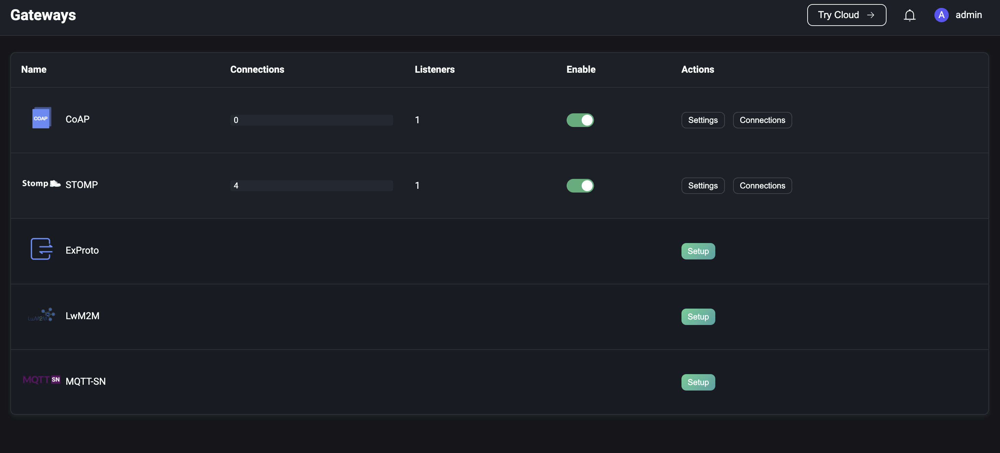
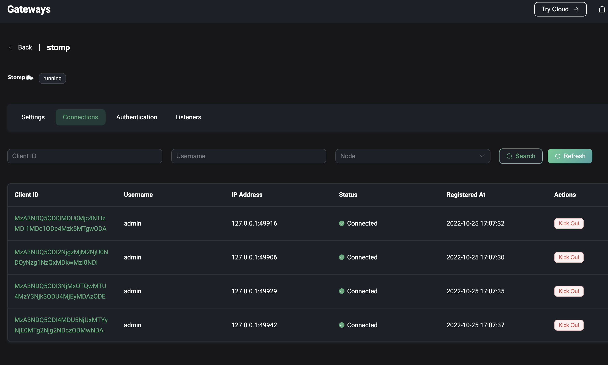
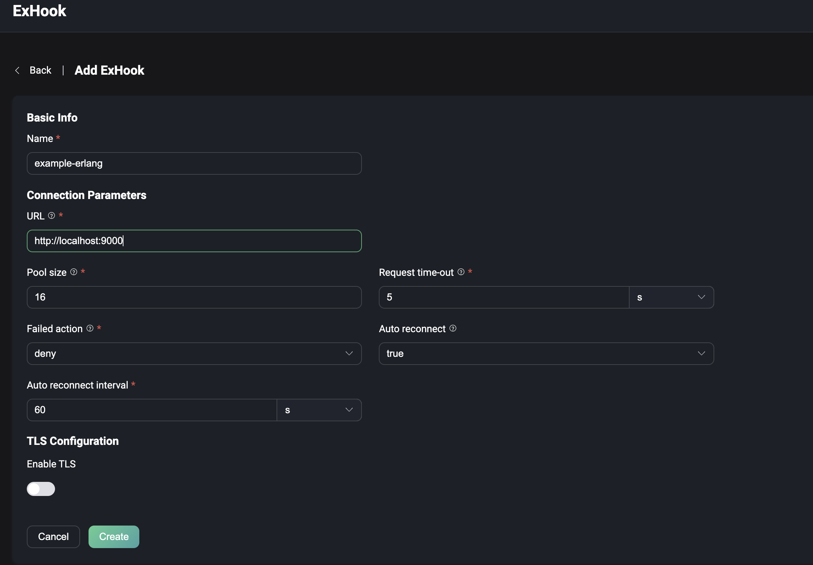
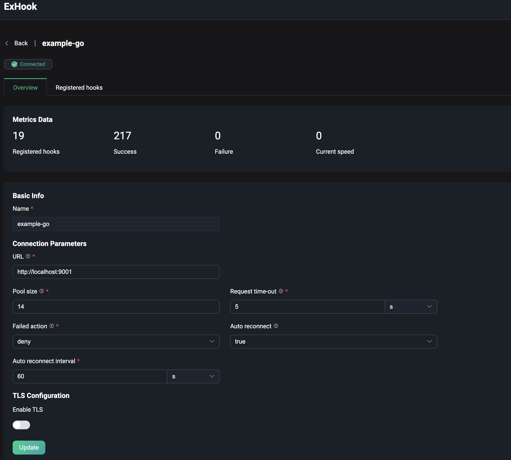
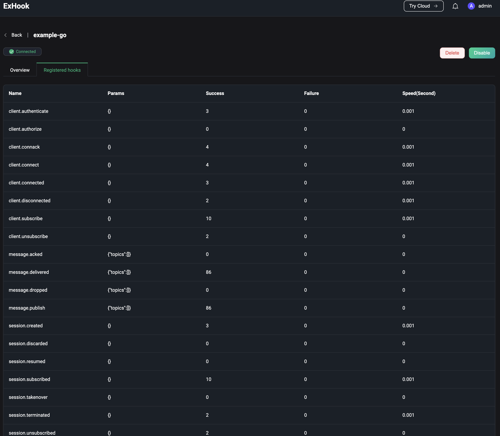
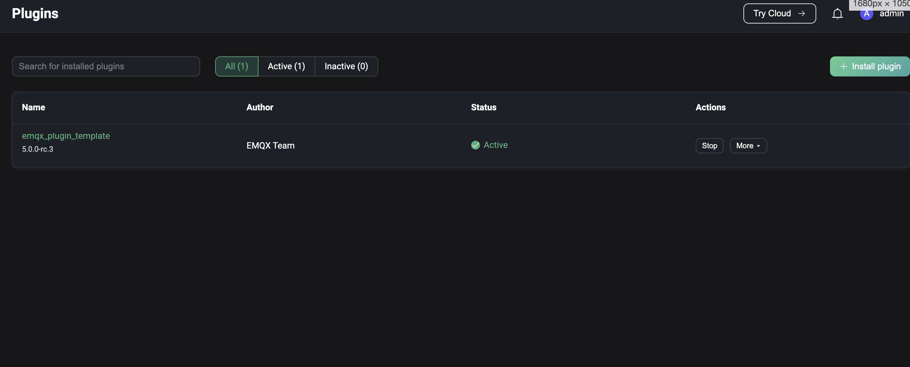

# Extensions

With the Extension module, users can use the gateway to access non-MQTT protocol connections and message publishing and receiving, and use the Plugin or ExHook to modify and extend the system.

- **Gateways**: Handles connections, authentication and message sending and receiving for all non-MQTT protocols and provides a unified user layer interface and concept for them.
- **ExHook**: Provides the ability to modify or extend the system functionality of EMQX using other languages.
- **Plugins**: Modifies or extends system functionality by installing plugins written in Erlang.

## Gateways

Click on the Gateways under the Extensions menu on the left to be taken to the Gateway page. The gateway provides the ability to access non-MQTT protocols. The protocols currently supported include

- [Stomp](https://stomp.github.io/stomp-specification-1.2.html)
- [MQTT-SN](https://www.oasis-open.org/committees/download.php/66091/MQTT-SN_spec_v1.2.pdf)
- [CoAP](https://datatracker.ietf.org/doc/html/draft-ietf-core-coap-pubsub-09)
- [ExProto](https://github.com/emqx/emqx-exproto)
- [LwM2M](https://www.openmobilealliance.org/release/LightweightM2M/)

Before enabling the gateway, the gateway needs to setup; after setup, you can view the number of connections through each enabled protocol gateway, and enable/disable gateways on the Gateways page.

### Gateway Setup

On the Gateways page, select the protocol gateway you wish to enable and click the `Setup` button to the right of the list to enter the initialize the protocol gateway page. There are 3 steps to initialize the gateway

1. Configure the basic configuration
2. Configure listeners
3. Configure the authentication

Each configuration item will be different depending on the protocol gateway; the configuration items can be updated after the initialization is complete by going to the gateway details page.

> Gateways configured via Dashboard will take effect across the cluster

#### Basic Configuration

The configuration form for the base configuration will vary depending on the protocol gateway, details of the configuration parameters for each protocol can be viewed by clicking on the jump to the configuration file description page.

<!-- FIXME: -->
- [Stomp](../admin/cfg.md#gatewaystomp)
- [MQTT-SN](../admin/cfg.md#gatewaymqttsn)
- [CoAP](../admin/cfg.md#gatewaycoap)
- [ExProto](../admin/cfg.md#gatewayexproto)
- [LwM2M](../admin/cfg.md#gatewaylwm2m)

#### Listener

Once the basic configuration are configured, the gateway's listeners can be configured; each gateway can have multiple listeners enabled, and different protocol gateways support the following listener types

|         | TCP  | UDP  | SSL  | DTLS |
| ------- | ---- | ---- | ---- | ---- |
| STOMP   | ✔︎    |      | ✔︎    |      |
| CoAP    |      | ✔︎    |      | ✔︎    |
| ExProto | ✔︎    | ✔︎    | ✔︎    | ✔︎    |
| MQTT-SN |      | ✔︎    |      | ✔︎    |
| LwM2M   |      | ✔︎    |      | ✔︎    |

#### Authentication

After configuring the listener, you can optionally configure the protocol gateway's access authentication as needed, or allow any client to connect in if no authenticator is configured; different protocol gateways support the following authentication types

|         | HTTP Server | Built-in Database | MySQL | MongoDB | PostgreSQL | Redis | DTLS | JWT  | Scram |
| ------- | ----------- | ----------------- | ----- | ------- | ---------- | ----- | ---- | ---- | ----- |
| STOMP   | ✔︎           | ✔︎                 | ✔︎     | ✔︎       | ✔︎          | ✔︎     | ✔︎    | ✔︎    |       |
| CoAP    | ✔︎           | ✔︎                 | ✔︎     | ✔︎       | ✔︎          | ✔︎     | ✔︎    | ✔︎    |       |
| ExProto | ✔︎           | ✔︎                 | ✔︎     | ✔︎       | ✔︎          | ✔︎     | ✔︎    | ✔︎    |       |
| MQTT-SN | ✔︎           |                   |       |         |            |       |      |      |       |
| LwM2M   | ✔︎           |                   |       |         |            |       |      |      |       |

### Gateway Details

After the protocol gateway setup and be enabled, it will return to the gateway page, select one of the initialized gateways, click the `Connections` button on the right side of the page to enter the gateway details page, you can view the list of clients connected to the server through the protocol gateway; the list will show the client ID and user name set by each client when connecting, the current connection status, the IP address of the client, the time when the client started to connect; the IP address data of the client will be displayed. The IP address of the client is the same as the connection page, and is made up of the IP address of the client and the port of the client used when the client was connected.

The client list can be searched using the client ID, username and node. On the top of the page you can click on the `Settings`, `Authentication`' or `Listener` menu buttons to switch to the corresponding page to modify the corresponding configuration.

## ExHook

Click ExHook under the extension menu on the left to come to the ExHook page, ExHook provides the ability to modify or expand system functions using other programming languages. The ExHook list page allows you to view the currently added ExHooks, the number of hooks mounted by each ExHook, and the number of successes and failures of all hooks executed under that ExHook.

Definitions and development guidelines for ExHooks can be found in [hooks](../advanced/hooks).

### Add ExHook

Click the `Add` button at the top right of the page to go to the Add ExHook page. Fill in the form with the basic information and connection parameters of the ExHook to be added and click the `Create` button to submit the data. After successful creation, you will be redirected to the ExHook list page.

### View details

After successful creation, you can access the ExHook details page by clicking on the ExHook name on the ExHook list page. On the details page, you can view the current ExHook metrics, including the total number of registered hooks, the total number of successful executions, the total number of failed executions and the current execution rate of all hooks. You can edit the basic information and click the `Update` button to save it.

Click on `Registered hooks` at the top of the page to view the list of hooks currently implemented by ExHook, as well as the parameters and execution metrics of each hook.

## Plugins

Click on Plugins under the extension menu on the left to go to the Plugins page; you can install or develop plugins to modify or extend the functionality of the system as required. Examples of plugins can be found at [emqx-plugin-template](https://github.com/emqx/emqx-plugin-template). The plugin list page shows the currently installed plugins and the version, author and running status of each plugin, and you can search the plugin list by filtering the data according to the plugin name and running status at the top of the page.

Click the `Install Plugin` button in the top right corner of the page to enter the plugin installation page. Upload the installation package or drag and drop the package into the dotted box on the page and click the `Install` button to submit the package. After the installation package is submitted successfully, the page will return to the plugin list page, the successfully installed plugin is stopped by default, if you want to enable it, you need to click the `Start` button on the right of the corresponding plugin to enable it, when there are more than one plugin, the order of enabling is the order of execution of the plugin; you can also drag and drop on the page or click the corresponding button under the `More` menu on the right of the plugin to sort the plugin, the sorting result is the order of execution of the plugin after the next node restart. If a plugin is no longer needed, you can uninstall it by clicking the `Uninstall` button under the `More` menu to the right of the plugin.

Clicking on the plugin name will redirect you to the plugin details page. The left side of the details page displays the `README.md` documentation from the plugin installation package, and the right side displays the plugin information provided in the `release.json` file from the plugin installation package. If the documentation also provides the relevant website of the plugin developer, you can jump to the relevant page by clicking `Read More` in the top right corner of the page.

