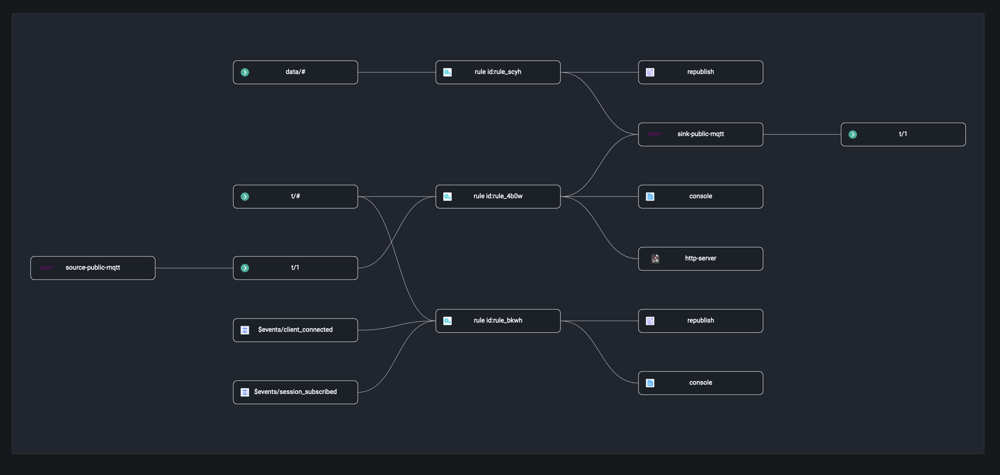

# Flows

Flows provides a visual way to view data integration. Flows are directed acyclic graphs (DAGs) composed of multiple nodes, each of which represents a data processing step, such as reading data from a topic, event, or data bridge, transforming data through rules, and forwarding data through data bridges in actions. Through Flows, users can clearly see the data flow, that is, how data flows from devices or clients through rule processing to external data systems or from external data systems through rule processing to devices.

Under the Data Integration menu on the left, users can enter the Flows page. Currently, this page only supports viewing. When there is a change in the rule and data bridge, refreshing the page will show the latest data integration.

Flows solves the problem of difficult maintenance and management of multiple rules and data bridges in data integration. Through the Flows page, users can also clearly see the relationship between each rule and data bridge, and monitor the status of any rule or data bridge node in this chain.When the mouse hovers over the rule and data bridge nodes, you can view the detailed information of each node, such as the execution statistics of the current rule on the rule node, the success and failure number, the enable and disable status of the rule, the SQL statement, etc. The data bridge node can view the success and failure statistics of the data bridge forwarding data, the message rate, and the connection status of the resources in the bridge. Clicking on the current node can quickly enter the preview page of the rule or data bridge to view more data statistics and quickly update the configuration.

