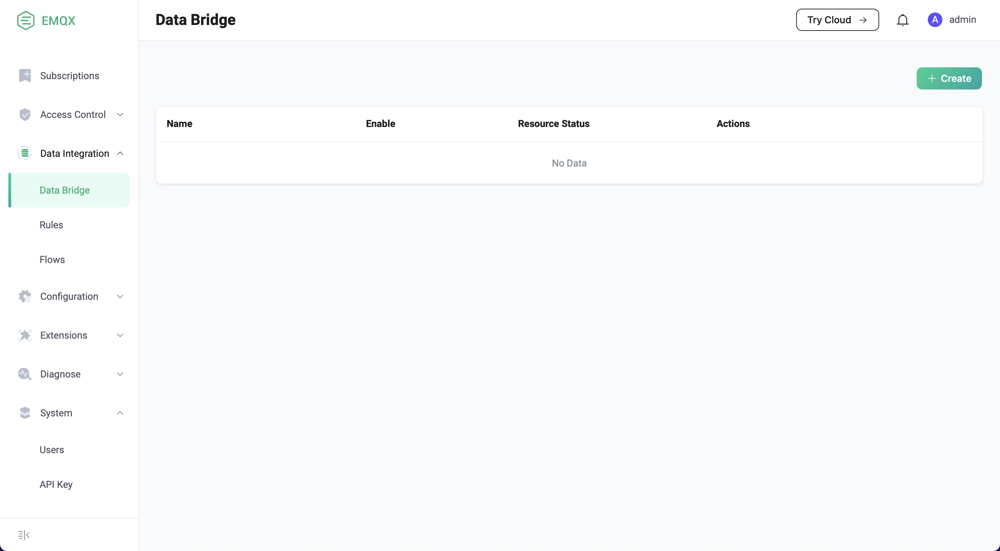
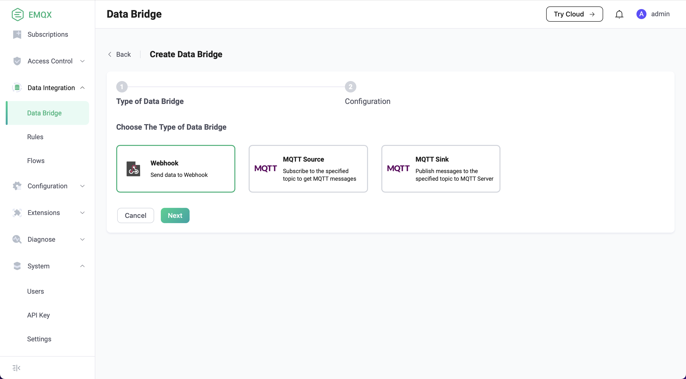
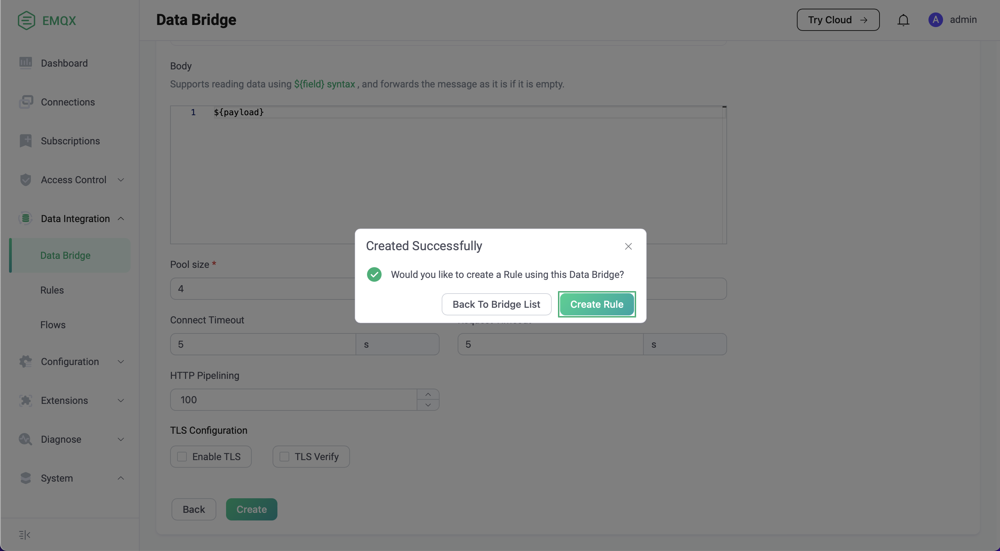

# Webhook

Webhook is the channel through which emqx sends messages to HTTP services.
Through webhooks, users can send to the remote HTTP service from a local topic,
or from the output of a rule.

## Quick Start

Add following configs to the end of the `emqx.conf` file:

```js
bridges.webhook.my_webhook {
    enable = true
    direction = egress
    url = "http://localhost:9901/${clientid}"
    local_topic = "a/#"
    method = post
    body = "${payload}"
    headers {
        "content-type": "application/json"
    }
}
```

This webhook forwards messages sent to this node which match `a/#` to `http://localhost:9901/${clientid}`.
Where `${clientid}` is a placeholder variable representing the sender's client ID.
For example, if the client ID is `steve`, the message will be sent to `http://localhost:9901/steve`.

Placeholders can be used in the following parameters: `method`, `body`, `headers` and `url`.

Note that placeholders can only be used in the path part of the `url` parameter, but cannot be used in the `scheme://host:port` part.

For all the available placeholder fields, see [event types and fields in rule SQL](./rule-sql-events-and-fields.md#mqtt-message).

## Quick Start with Data Bridge

We use an example to show how to use dashboard to create a simple webhook that bridges to an HTTP server.

### Setup a Simple HTTP Server

First, we use Python to build a simple HTTP service. This HTTP service receives `POST /` requests,
It returns `200 OK` after simply printing the requested content:

```
from flask import Flask, json, request

api = Flask(__name__)

@api.route('/', methods=['POST'])
def print_messages():
  reply= {"result": "ok", "message": "success"}
  print("got post request: ", request.get_data())
  return json.dumps(reply), 200

if __name__ == '__main__':
  api.run()
```

Save the above code as `http_server.py` file. Then start the server by running:

```shell
pip install flask

python3 http_server.py
```

### Create Webhook and Bind it to the Rule

Now let's visit the dashboard and select "Data Integration" - "Data Bridge" in the sidebar on the left:



Then click "Create", select "Webhook", and click "Next":



We named webhook as `my_webhook`, and set URL to `http://localhost:5000`:


Click the "Create", then select "Create Rule" in the dialog box:



On the rule creation page, fill in the following SQL statements, and keep the default values of other parameters:

```SQL
SELECT * FROM "t/#"
```


Click the "Create" button at the bottom of the page, the creation should be OK.

### Send Messages for Testing

Next we use [MQTTX](https://mqttx.app/) to send a message to `t/1`


Then we verify that the message has been sent to the HTTP server:

```
python3 http_server.py
 * Serving Flask app 'http_server' (lazy loading)
 * Environment: production
   WARNING: This is a development server. Do not use it in a production deployment.
   Use a production WSGI server instead.
 * Debug mode: off
 * Running on http://127.0.0.1:5000 (Press CTRL+C to quit)

got post request:  b'eee'
```
