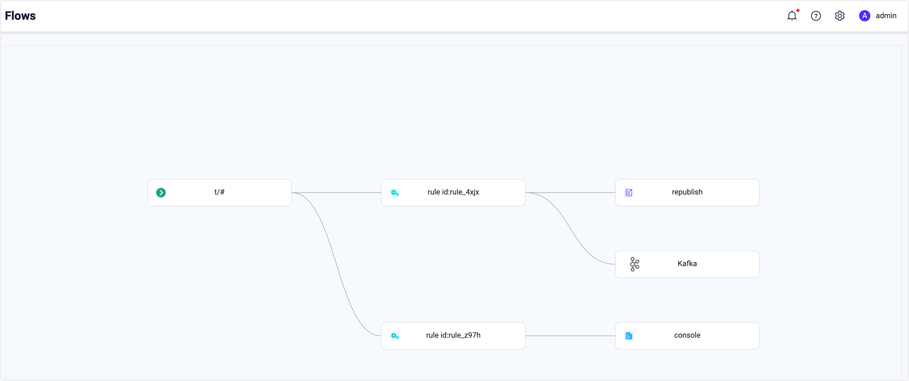

# Create Rules

This guide introduces how to create a rule using the EMQX Dashboard. Log in to the EMQX Dashboard and click **Data Integration** -> **Rules** in the left navigation tree. Then click the **Create** button, which directs you to the **Rules** page. Here, you can define the data source for your rule and determine the subsequent actions for the filtered messages, such as republishing, printing the result to the Console, or forwarding with data bridges.

The following steps demonstrate how to create a rule that listens to messages with the topic `t/#` and forwards the received messages to the topic `a/1`.

## Define a Data Source
On the **Rules** page, input a name for your rule and add a note to facilitate future management. 

In the **SQL Editor**, you can customize the statements to add a data source that suits your business needs. For this tutorial, keep the default setting, which selects and returns all messages under topics that follow the `"t/#"` pattern (e.g., `t/a`, `t/a/b`, `t/a/b/c`, etc.).

::: tip
This tutorial assumes the payload is JSON.

<!--If the payload is formatted in some other way, you can convert the data type, for example, with the Schema Registry TODO. 
-->

EMQX has embedded rich SQL statement samples to help you get started, you can click the **SQL Example** button under the **SQL Editor** to explore. For more details about the SQL syntax and usages, see [SQL Syntax](./rule-sql-syntax.md).

:::


## Test the SQL Statements

This is an optional step, but it is recommended if you are new to EMQX rules. Turn on the **Enable Test** toggle switch to enable the SQL statement testing.


As shown in the screenshot above, EMQX has provided default values for all fields, such as **Data Source**, **Client ID**, **Username**, **Topic**, **QoS**, and **Payload**, you can just click the **Run Test** button to start the start.  A**Test Passed** prompt will appear if everything is working as expected. 

The processing result of SQL will be presented in the **Output Result** section in the form of JSON. All the fields in SQL processing results can be referenced in the form of `${key}` by the subsequent actions (built-in actions or data bridges). For detailed explanation of the fields, see [SQL Data Sources and Fields](./rule-sql-events-and-fields.md).

## Add Republish Action

To republish the messages under topic "t/#" to topic "a/1", click the **Add Action** button on the right side of the page. Select **Republish** from the drop-down menu under **Action**, and configure the following settings before clicking the **Add** button to confirm:

- **Topic**: Set the target topic, "a/1" in this example;
- **QoS**: Set the QoS of the republished message, "0" in this example;
- **Retain**: Set whether to forward this message as a retained message, for this tutorial, keep the default setting, **false**;
- **Payload**: Input "${payload}", indicating the republished message will have the same payload as the original message, without any modifications.


On the **Rules** page, click the **Create** button at the bottom to complete the rule creation. This rule will be added to as a new entry in the **Rules** page. You can view the rule ID, data source, enable or disable the rule, and creation time. You can also click **Settings** to modify the data source or add more action, or click the **More** button to duplicate or delete the rule. 

::: tip
The republishing action does not prevent the delivery of the original message. For example, according to the rule, messages under topic "t/1" will be republished under topic "a/1", in the meantime "t/1" message will still be delivered to the clients subscribed to topic  "t/1".
:::

**Add Console Output Action**

In addition to the republishing action, you can choose to print the output of the rule to the console for debugging purposes. 

The console output action is used to print the result message of a rule to the console or log file. 

* If EMQX is started with `emqx console`, the results will be printed to the terminal where `emqx console` was invoked.
* If EMQX is started with `emqx start`, the results will be printed to a log file (`erlang log.*`) under the `log` dir of EMQX.

The output will be in the format below

```bash
[rule action] rule_id1
    Action Data: #{key1 => val1}
    Envs: #{key1 => val1, key2 => val2}
```

Where

-  `[rule action]` is the rule ID where the republish action is triggered.
-  `Action Data` is the output result of the rule, indicating the data or parameter that should be passed to the action when it is executed, that is, the payload part when you set up the republish action. 
-  `Envs` is the environment variable that should be set when republishing, which could be the data source and other internal information related to the execution of this action.

::: tip
The console output action should only be used for debugging. If it is used in the production environment, it may cause performance problems.
:::

**Forward with Data Bridge**

You can also add actions to forward the processed results with data bridges. All you need is to select the target Data bridge from the Data bridge drop-down list. For details on creating data bridges in EMQX, see [the documentation for Data Bridges](./data-bridges.md). 

## Test the Rule

Now you can use [MQTT X](https://mqttx.app/) to test this rule. Create one client, and then use this client to subscribe to the "a/1" topic and send a "t/1" message. You will see in the dialog box that this message is also republished to the topic "a/1".

For details on how to build the connection between the MQTT X client tool and EMQX, see [MQTT X - Get Started](https://mqttx.app/docs/get-started). 


## View the Rules

EMQX 5.0 introduced the Flows editor to provide a visualized view of the rules you created. Click **Data Integration** -> **Flows** to access it. The window shows that you have created two rules for all messages with topics following the "t/#" pattern: "rule_4xjx" publishes the messages and streams data into Kafka, and "rule_z97h" prints the messages to the console.



You can click the rule ID on the **Flows** page or **Rules** page to view the execution and action statistics parsed by the rule. 

Note: If you update the rule action or redefine the data source, the statistics listed on the page below will reset and start fresh.


