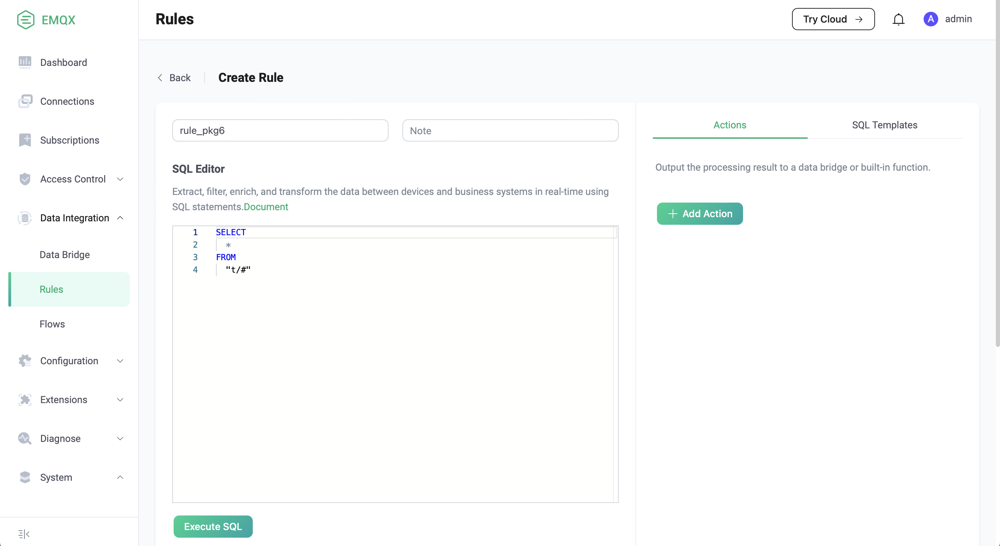
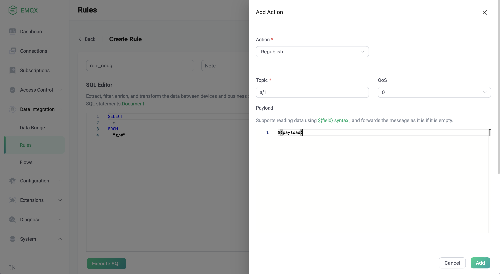
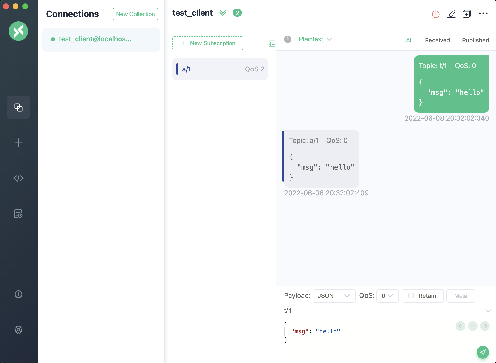
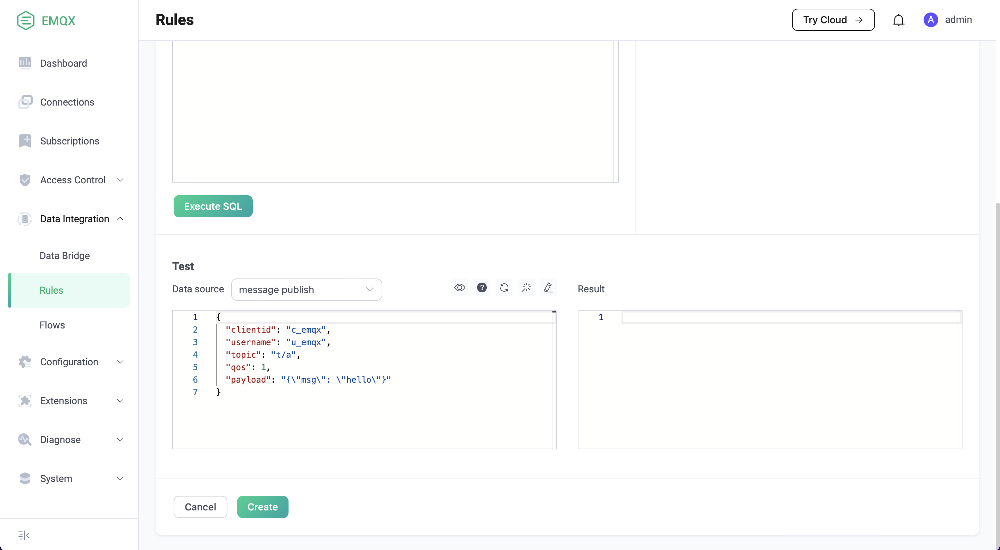

# Get Started With Rules

We use an example to show how to use dashboard to create a simple rule.
This rule listens to the message with the topic `t/#` and sends another message with the topic `a/1`:

## Create a Rule
On the dashboard, select "Data Integration" - "Rules" - "Create" to enter the rule creation page:

## Add "Republish" Action

Keep the default rule name and SQL statement unchanged, click the "add action" button, and add a `republish` action according to the following parameters:

- Topic: "a/1"
- QoS: 0
- Payload: ${payload}

Finally, go back to the rule creation page and click the Create button at the bottom of the page to complete the rule creation.

## Test by Sending Messages

Now let's test this rule, connect a MQTT client using [MQTTX](https://mqttx.app/), subscribe to the "a/1" topic and send a "t/1" message:

We see that the rule works and the MQTT client have received a message with the topic "a/1".

## Test the SQL

Dashboard provides the function of testing SQL statements. On the rule creation page, click "execute SQL" to display the SQL test results in real time through the given SQL statements and event parameters.

The processing result of SQL will be presented in the **Result** text box in the form of JSON. All the fields in SQL processing results can be referenced in the form of `${key}` by the subsequent actions (built-in actions or data bridges).
