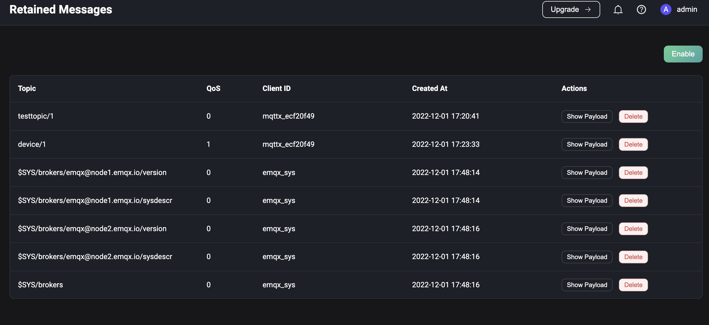

# Retained Message

The EMQX implements the retained message feature of MQTT. You can use the [MQTT X Client](https://mqttx.app/) and [MQTT X CLI](https://mqttx.app/cli) to test this messaging service in EMQX. This section introduces how to publish a retained message and how the retained message is received. 

:::tip Prerequisites

- Knowledge about MQTT [Retained Message](./mqtt-concepts.md/#retained-message)
- Basic publishing and subscribing operations using [MQTT X](./mqtt-publish-and-subscribe.md/#mqtt-x)

:::

## Publish Retained Message with MQTT X Client

1. Start the MQTT X Client. Click the **New Connection** to create an MQTT connection named "Demo".

   ::: tip Tip

   For detailed instructions on creating an MQTT connection, see [MQTT X Client](./publish-and-subscribe.md/#mqtt-x-client).

   :::

   

3. After the success connection, type the topic heading `sensor/t1` in the text box and compose the message as shown in the screenshot. Click the send button. A message under the topic `sensor/t1` is send to the dialogue box.

   

4. Publish two retained messages under the topic `sensor/t2`. 

   1. Type the topic as `sensor/t2`. Type the first message as `1`. Select `Retain`. Click the send button.
   2. Type the second message as `2`. Click the send button.

   

5. Click the **New Subscription** button to create a subscription. Input `sensor/+` in the **Topic** text box. Click the **Confirm** button. The subscription only receives the last retained message. 

   :::tip

   With topic set to `sensor/+`, both `sensor/t1` and `sensor/t2` are subscribed. For more information on topics and wildcards, see [Understanding MQTT Topics & Wildcards by Case](https://www.emqx.com/en/blog/advanced-features-of-mqtt-topics).

   :::

   

   

   :::tip

   The normal message under the topic `sensor/t1` and the first retained message under the topic `sensor/t2` are not received. The EMQX only stores the latest retained message for each topic. You can also check the latest retained message stored in the EMQX Dashboard, see [View Retained Message in Dashboard](##View Retained Message in Dashboard).

   

   :::  

6. If you want to clear the retained message from the MQTT broker, send an empty retained message  under the topic.

## Publish Retained Message with MQTT X CLI

1. Initiate a connection request with one client. Set the topic to `t/1`, payload to `A retained message from MQTTX CLI`,  and `retain = true`：

   ```bash
   mqttx pub -t 't/1' -m 'A retained message from MQTTX CLI' --retain true -h 'localhost' -p 1883
   ```

2. Subscribe to the topic `t/1` with another client. It will receive the retained message. Repeat this step and it will continuously receive the retained message:

   ```bash
   $ mqttx sub -t 't/1' -h 'localhost' -p 1883 -v
   topic:  t/1
   payload:  A retained message from MQTTX CLI
   retain: true
   ```

3. Publish an empty message to clear the retained message:

   ```bash
   mqttx pub -t 't/1' -m '' --retain true -h 'localhost' -p 1883
   ```

4. Repeat Step 2 and no retained messages are received, indicating the retained message is cleared. 

## View Retained Message in Dashboard

Click the **Retained Messages** menu on the left to go to the **Retained Messages** list page. It lists all retained messages in the EMQX.

When a user publishes a retained message, EMQX will save this message in the system. The user can view this message on the Retained Messages list page. When the user subscribes to the topic of this retained message, EMQX will publish this message to the topic, and users can receive this message immediately by subscribing to the topic.

The default expiration time of the retained message is never expired unless the user manually deletes this message.

### Retained Messages List

The user can view all retained messages in the system on the **Retained Messages** list page. The list includes the topic of the retained message, the QoS of the retained message, the time when the retained message was published, and the client ID of the retained message. In the list, the user can click the **Show Payload** and **Delete** buttons to view the Payload of the retained message and delete a retained message. Click the **Refresh** button in the upper right corner of the list to refresh the current retained message list, and click the **Settings** button to jump to the retained message settings page.

The default will save three types of retained messages [system topics](./mqtt-concepts/#system topic). If it is a cluster environment, it will keep different system topics' retained messages according to other node names. They are:

- $SYS/brokers/+/sysdescr - The system description of the current EMQX node
- $SYS/brokers/+/version - The version number of the current EMQX node
- $SYS/brokers - The number and name of all nodes of the current EMQX



### Delete Retained Message

In most cases, users can delete retained messages in the client by publishing an empty message to the topic of the retained message. In addition, users can also delete retained messages in EMQX Dashboard. Click the **Delete** button on the Retained Messages list page to delete a retained message. Users can also set the expiration time of the retained message on the Retained Messages configuration page. When the retained message expires, EMQX will automatically delete this retained message.