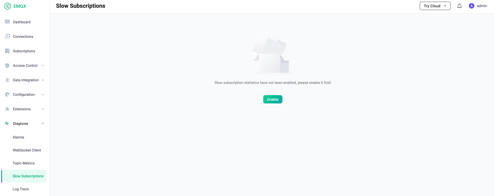
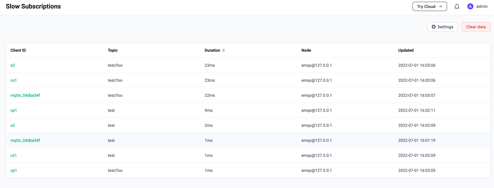
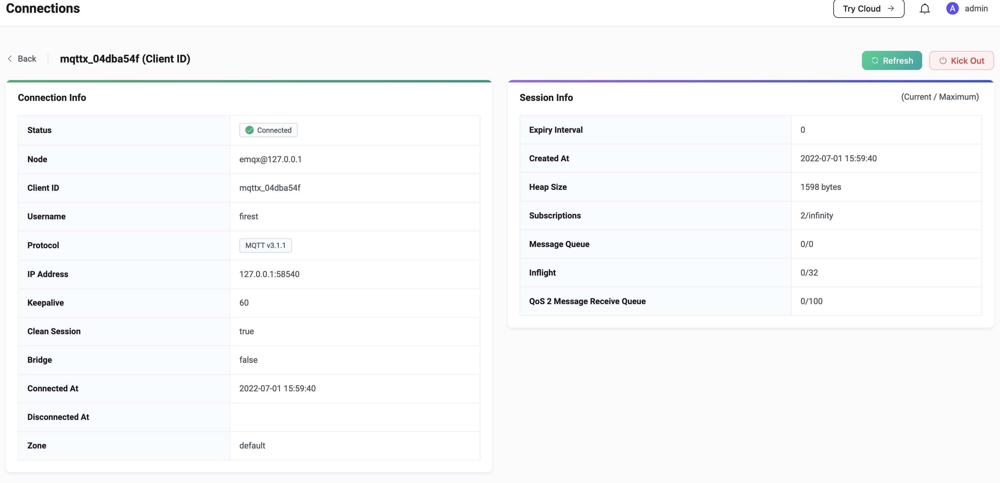

# Slow Subscriptions

Typically, EMQX will finish the message transmission within milliseconds, affected mainly by the network. However, there are cases where the latency of subscription messages is very high on the client side. To solve this problem, EMQX provides a Slow subscriptions feature.

## How It Works

EMQX will start calculating the time (delay) it takes for the message to be processed and transmitted since messages **arrive at EMQX**. 

If the delay exceeds the specified threshold, EMQX will insert the corresponding **subscriber and topic** into the **slow subscriptions list** or update the existing record. 

Slow subscriptions list:

- The data in the list are in descending order by the time delay and can save up to 1000 records.
- The list records the **subscriber-topic** data rather than the messages that exceed the threshold.
- When a record is generated, if it is a new record, it will be inserted into the list; if not, the occurrence time of the existing record will be updated, and in both cases, the entire list will be re-ranked.
- After the record is generated, it will be removed from the list if it is not triggered again within the effective period (default: 300 seconds).

The definition of message transfer complete varies with the message QoS level:

- QoS 0: The message is sent successfully.
- QoS 1: EMQX receives the PUBACK packet from the client.
- QoS 2: EMQX receives the PUBCOMP packet from the client.

Factors affecting message latency:

- The network between the publisher and EMQX is slow (will be available in future releases).
- The execution speed of the Hooks is slow, which blocks message publishing, such as ACL checks, ExHooks, rule engines, etc. 
- Too many messages accumulate in the queue, resulting in significant latency, for example, PUBLISH and SUBSCRIBE share the same connection, and many PUBLISH messages are accumulated in the queue. 
- The receiving speed of the subscribers is too slow. 

## Configure and Enable Slow Subscriptions

<!-- TODO 补充配置文件配置方式，目前该方式有 BUG 暂时不在文档中提供。 -->

On EMQX Dashboard, click `Diagnose` and select `Slow Subscriptions`, then `Enable` it.

Follow the instruction below for configuration:

- **Stats Threshold**:  Latency threshold for statistics, only messages information with latency exceeding the value will be collected. Minimum value: 100ms
  **Maximum Number of Statistics**: Maximum number of records in the slow subscription statistics record table. Maximum value: 1,000
- **Eviction Time of Record**: Eviction time of the record; will start the counting since creation of the record, and the records that are not triggered again within the specified period will be removed from the list. Default: 300s
- **Stats Type**: Calculation methods of the latency, which are
  - **whole**: From the time the message arrives at EMQX until the message transmission completes
  - **internal**: From when the message arrives at EMQX until when EMQX starts delivering the message
  - **response** : From the time EMQX starts delivering the message until the message transmission completes

## Check Slow Subscriptions List

The Slow Subscriptions list contains the following fields:

- Client ID: client with the slow subscriptions issue

- Topic: topic with the slow subscriptions issue
- Duration: message latency
- Node:  node with the slow subscriptions issue
- Updated: creation/update time of the record

You can click on the Client ID to view the details and troubleshoot the issue. 

