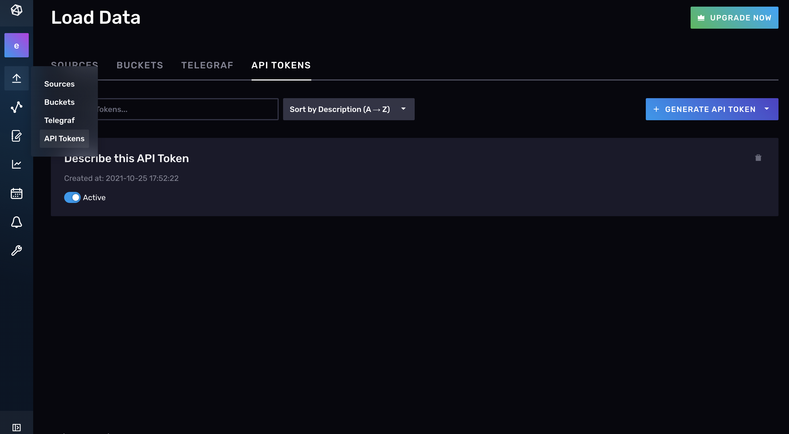
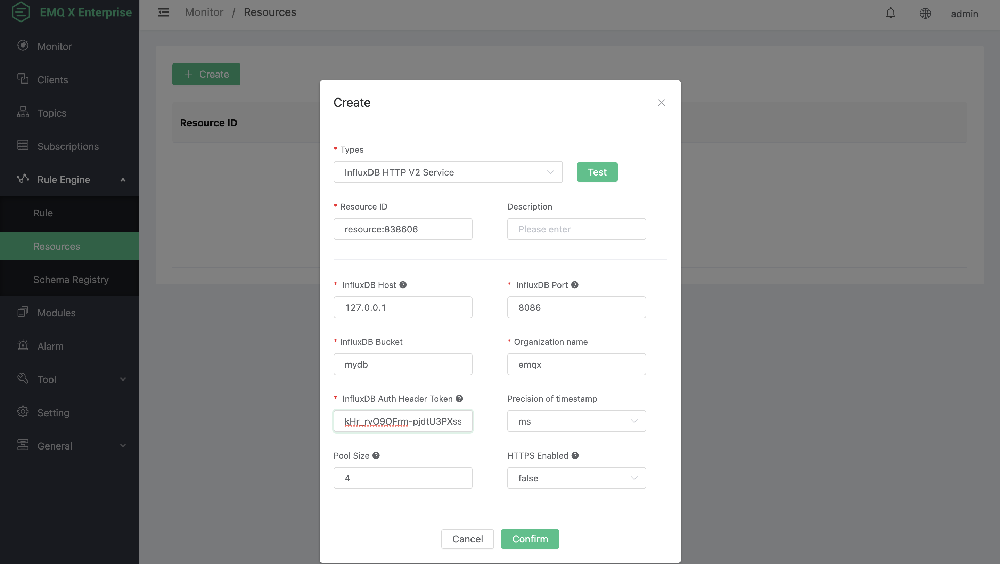
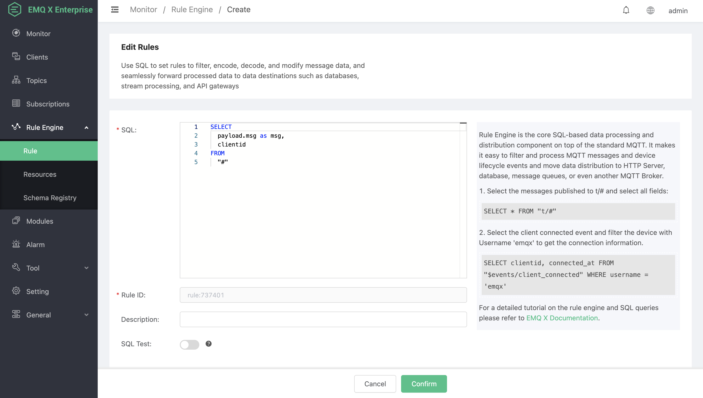
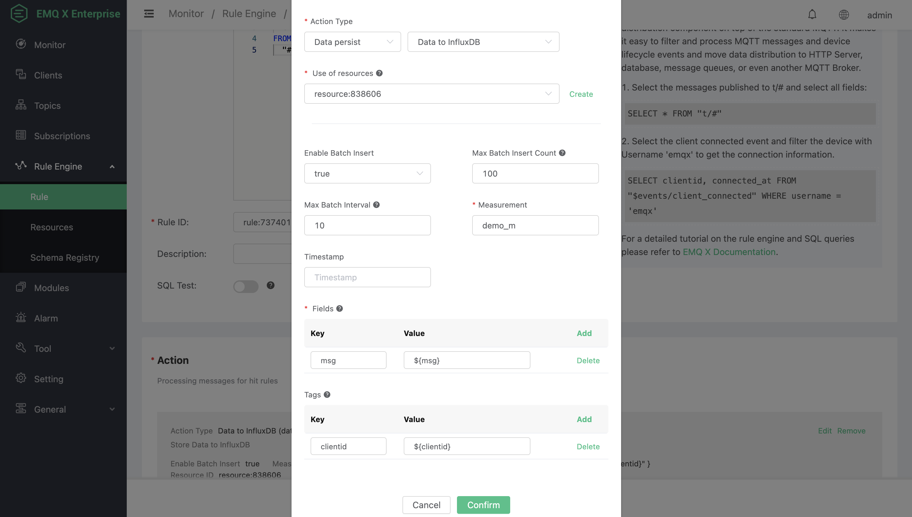
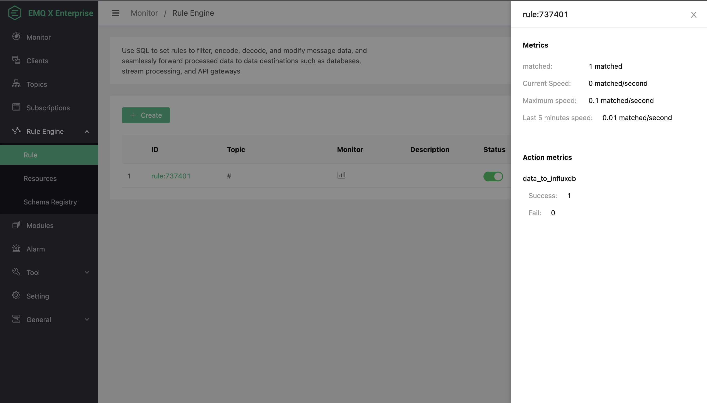

# Ingest Data into InfluxDB V2 & InfluxDB Cloud

Start InfluxDB, or register an InfluxDB Cloud account to apply for the service.
In this article, docker deployment is used as a demonstration, and the default port 8086 is used. If necessary, please replace it with other ports.

 ```shell
#  docker
docker run -d  -p 8086:8086  influxdb
 ```

Configure the resource

Open [EMQX Dashboard](http://127.0.0.1:18083/#/rules), select the "Resources" tab on the left, click "Create", and select "InfluxDB HTTP V2 Service" as the resource type.

The following configurations are included in the resource:

- InfluxDB host: fill in the host address or the service address created in InfluxDB Cloud;
- InfluxDB port: The default port for local installation or docker installation is 8086, and the https default port 443 is used for InfluxDB Cloud installation;
- InfluxDB Bucket: Bucket set name;
- InfluxDB organization name: the name of the organization filled in when creating the service;
- InfluxDB Token: API Token corresponding to database permissions, which can be found in the InfluxDB console;
- Timestamp accuracy: milliseconds by default;
- Process pool size: The size of the connection process pool, which can be adjusted according to the amount of concurrency of the business (it is recommended to increase one process per 10,000 concurrencies when there is no bottleneck in the network speed);
- Enable HTTPS: enable the certificate according to the installation and service configuration (For InfluxDB Cloud, please enable this option, but no additional certificate configuration is required);

Example of obtaining organization name by InfluxDB Cloud (For local or docker deployment, you can enter the console by accessing port 8086 of the deployment address):


Example of obtaining API Token by InfluxDB Cloud (For local or docker deployment, you can enter the console by accessing port 8086 of the deployment address):


Create the resource:


Create a rule:

Open [EMQX Dashboard](http://127.0.0.1:18083/#/rules) and select the "Rule" tab on the left.

Fill in the rule SQL:

```SQL
SELECT
  payload.msg as msg,
  clientid
FROM
  "#"
```



Related action:

On the "Action" interface, select "Add action", and then select "Data to InfluxDB" in the “Action Type” drop-down box.

Required fields:

- Enable batch insertion: whether to enable batch function;
- Maximum batch number: the maximum number of pieces of data contained in a single request;
- Maximum batch interval: the maximum interval between batch messages;
- Measurement: InfluxDB Measurement unit;
- Fields: data key-value pair fields;
- Tags: data tags;



Finally, click "Confirm".

Return to the response action interface, select the InfluxDB resource just created, fill in other configurations and click "Confirm".

The rule has been created. Now, send a message:

```bash
Topic: "t/1"

QoS: 0

Payload:
"hello"
```

In the rule list, you can see that the number of matches of the rule just created has increased by 1:



Query the results in the InfluxDB console:


