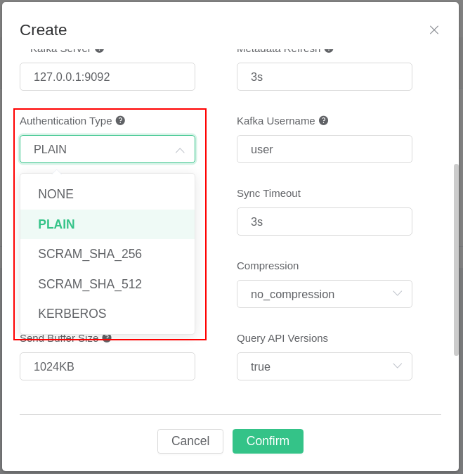
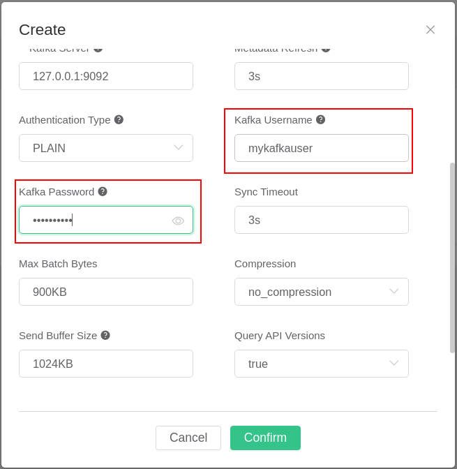
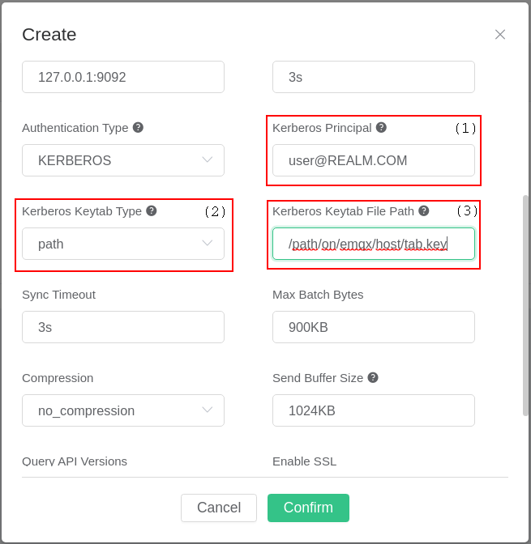

# Bridge data to Kafka

Setup a Kafka, taking Mac OSX for instance:

```bash
wget https://archive.apache.org/dist/kafka/2.8.0/kafka_2.13-2.8.0.tgz

tar -xzf  kafka_2.13-2.8.0.tgz

cd kafka_2.13-2.8.0

# start Zookeeper
./bin/zookeeper-server-start.sh config/zookeeper.properties
# start Kafka
./bin/kafka-server-start.sh config/server.properties
```


Create topics for
    Kafka:

```bash
$ ./bin/kafka-topics.sh --zookeeper localhost:2181 --replication-factor 1 --partitions 1 --topic testTopic --create

Created topic testTopic.

.. note:: Kafka topics should be created before creating the kafka rule, or the rule creation would not success.
```

Create a rule:

Go to [EMQX Dashboard](http://127.0.0.1:18083/#/rules), select the
"rule" tab on the menu to the left.

Select "message.publish", then type in the following SQL:

```bash
SELECT
    *
FROM
    "message.publish"
```


Bind an action:

Click on the "+ Add" button under "Action Handler", and then select
    "Data bridge to Kafka" in the pop-up dialog window.


Fill in the parameters required by the action:

Two parameters is required by action "Data to Kafka":

1). Kafka Topic

2). Bind a resource to the action. Since the dropdown list "Resource"
is empty for now, we create a new resource by clicking on the "New
Resource" to the top right, and then select "Kafka":


Configure the resource:

Set the "Kafka Server" to "127.0.0.1:9092" (multiple servers should
be separated by comma), and keep all other configs as default, and
click on the "Testing Connection" button to make sure the connection
can be created successfully, and then click on the "Create" button.


Back to the "Actions" dialog, and then click on the "Confirm"
    button.


Back to the creating rule page, then click on "Create" button. The
    rule we created will be show in the rule list:


We have finished, testing the rule by sending an MQTT message to
    emqx:

```bash
Topic: "t/1"

QoS: 0

Retained: false

Payload: "hello"
```

Then inspect Kafka by consume from the
topic:

```bash
$ ./bin/kafka-console-consumer.sh --bootstrap-server 127.0.0.1:9092  --topic testTopic --from-beginning
```

And from the rule list, verify that the "Matched" column has increased
to 1:


## Authentication

This section describes how one can configure a Kafka resource to use an
authentication mechanism. The EMQX Kafka resource supports the following
authentication methods for Kafka: `NONE` (no authentication needed),
`SCRAM_SHA_256`, `SCRAM_SHA_512`, and `Kerberos`. We refer to the
[Kafka documentation](https://docs.confluent.io/platform/current/kafka/overview-authentication-methods.html)
for how to set up Kafka to use these different authentication mechanisms. The
authentication mechanism used can be selected under "Authentication Type" (see
image below). Depending on which authentication type is selected, different
fields will appear.



The fields for the authentication methods PLAIN, SCRAM_SHA_256, and
SCRAM_SHA_512 are the Kafka username and password (see picture below).



The Kerberos authentication method is slightly more complex to configure.
Before the Kafka resource is set up with Kerberos authentication, it is assumed
that you have a Kafka instance set up with Kerberos authentication and the
Keytab file for a Kerberos principal (a.k.a. user) with rights to access the
Kafka instance. We refer to the
[documentation of Kafka](https://docs.confluent.io/platform/current/kafka/authentication_sasl/authentication_sasl_gssapi.html#kafka-sasl-auth-gssapi)
and [Kerberos](https://web.mit.edu/kerberos/krb5-latest/doc/admin/index.html)
for how to set up Kerberos authentication for Kafka. You might also find the
[Kafka and Kerberos example from the brod_gssapi project](https://github.com/kafka4beam/brod_gssapi/tree/master/example) useful.
Here is a list of common pitfalls that is worth being aware of before
proceeding:

* One must install Kerberos libraries, the SASL library, and the SASL/GSSAPI
  Kerberos plugin on the hosts running EMQX for Kerberos authentication to work
  correctly. EMQX's official Docker images contain the needed libraries. If you
  are building EMQX by yourself, you must ensure that the required libraries
  are installed before the build starts. If the build process does not find the
  libraries necessary for Kerberos authentication, a warning will be printed
  when building, and support for Kerberos authentication will be disabled. On
  Centos 7, the following packages need to be installed `libsasl2`,
  `libsasl2-dev`, `krb5-workstation`, `cyrus-sasl-devel`, `cyrus-sasl`,
  `cyrus-sasl-gssapi` and `krb5-server`. On Ubuntu 22.04, the following
  packages need to be installed `krb5-kdc`, `krb5-admin-server`, `libkrb5-dev`,
  `libsasl2-dev` and `libsasl2-modules-gssapi-mit`. Please refer to
  [EMQX's official Docker files](https://github.com/emqx/emqx-builder) for which
  packages are required on other platforms.
* The Kerberos configuration file `/etc/krb5.conf` needs to be in sync between
  all Kerberos clients and servers. One must copy the `/etc/krb5.conf` file to
  all the nodes in a multi-node cluster. Please refer to the
  [Kerberos documentation](https://web.mit.edu/kerberos/krb5-latest/doc/admin/conf_files/krb5_conf.html?highlight=krb5%20conf) for how to configure `/etc/krb5.conf`.
* Kerberos is time sensitive, so the hosts running EMQX, the Kerberos Key
  Distribution Center, and Kafka must have their time synchronized.

When configuring a Kafka resource with Kerberos authentication, one has to set
a Kerberos principal ((1) in the image below) and a corresponding Kerberos
Keytab ((2) and (3) in the image below). There are two options for specifying
the Keytab file ((2) in the image below). The Keytab can be uploaded to the
host directly from the configuration UI, or one can specify a path to the
Keytab file on the host. The field marked with (3)'s type changes depending on
how one sets the field marked with (2). If a Keytab path is specified and EMQX
is set up as a multi-node cluster, one must upload the Keytab file to the
specified path on all nodes.



