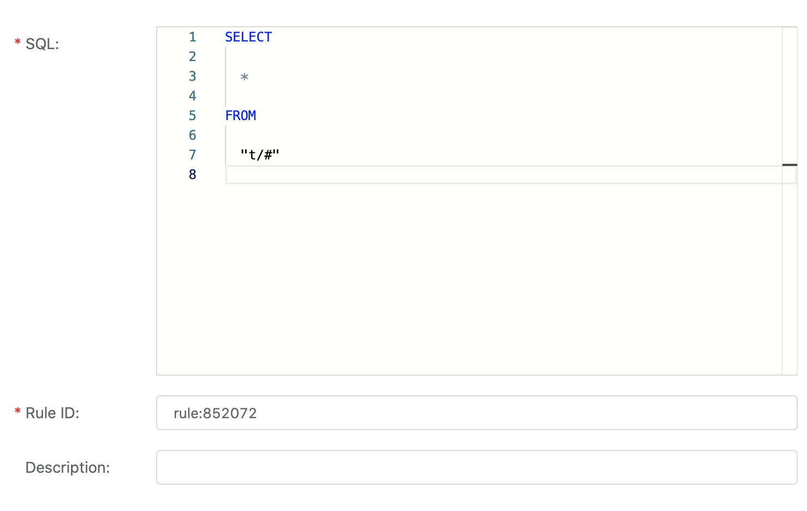
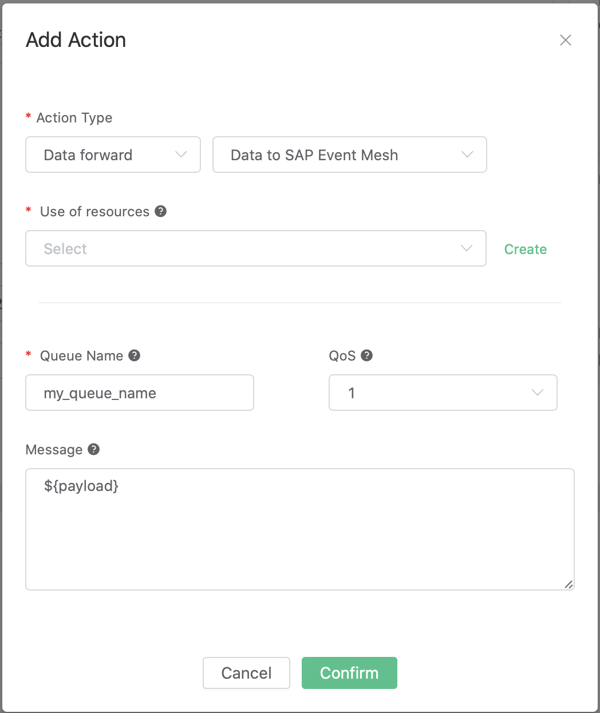
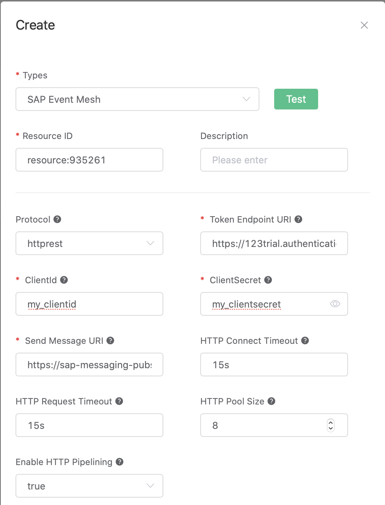
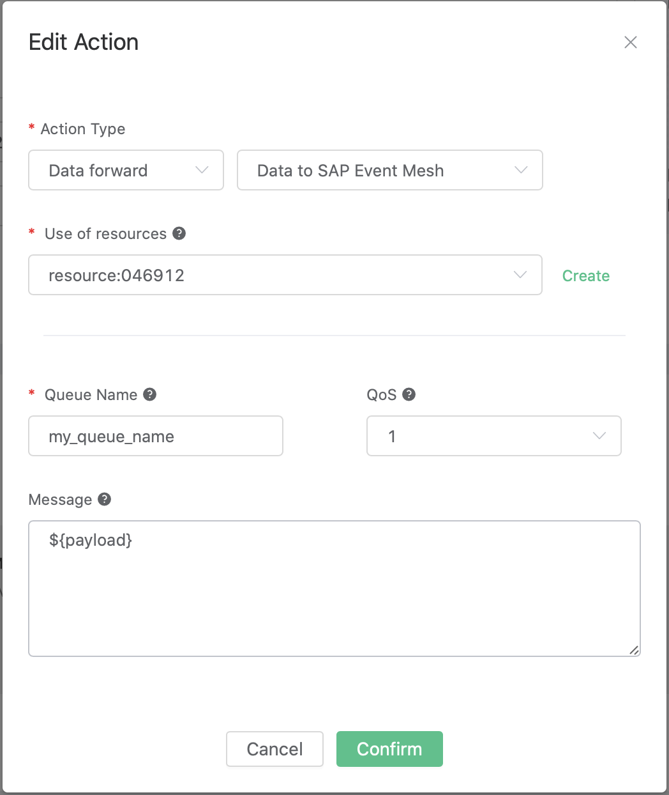

# Bridge Data to SAP Event Mesh

EMQX Rule Engine supports sending messages to [SAP Event Mesh](https://help.sap.com/viewer/bf82e6b26456494cbdd197057c09979f/Cloud/en-US) through HTTP request (`httprest`).

Event Mesh is an important message exchange component of [SAP BTP](https://www.sap.com/products/business-technology-platform.html).

The SAP BTP includes all the technology combinations, such as SAP HANA (in memory computing platform),
SAP Analytics Cloud (analysis cloud), SAP Integration Suite and SAP Extension Suite.

The IoT data of EMQX can be sent to these products of SAP BTP through this bridge.

## Prepare the SAP Event Mesh environment

Prepare the SAP Event Mesh environment and obtain the service keys.
For details see [Create Instance of SAP Event Mesh](https://developers.sap.com/tutorials/cp-enterprisemessaging-instance-create.html)。

Take the following Service Keys as an example:

```bash
{
    "xsappname": "some-app-name",
    "management": [
        {
            "oa2": {
                ...
            },
            "uri": "..."
        }
    ],
    "messaging": [
        {
            "oa2": {
                "clientid": "my_clientid",
                "clientsecret": "my_clientsecret",
                "tokenendpoint": "https://123trial.authentication.demo.com/oauth/token",
                "granttype": "client_credentials"
            },
            "protocol": [
                "amqp10ws"
            ]
        },
        {
            "oa2": {
                "clientid": "my_clientid",
                "clientsecret": "my_clientidsecret",
                "tokenendpoint": "https://123trial.authentication.demo.com/oauth/token",
                "granttype": "client_credentials"
            },
            "protocol": [
                "httprest"
            ],
            "broker": {
                "type": "saprestmgw"
            },
            "uri": "https://sap-messaging-pubsub.fooapps.demo.com"
        }
    ],
    "serviceinstanceid": "188783-7893-8765-8872-77866"
}
```

We only care about the `"messaging"` field of the Service Keys, we can get the following
information related to `protocol: ["httprest"]`:

| Key                | Value|
|--------------------|------------------------------|
| Token Endpoint URI | https://123trial.authentication.demo.com/oauth/token |
| Send Message URI | https://sap-messaging-pubsub.fooapps.demo.com |
| ClientId | my_clientid |
| ClientSecret | my_clientsecret |

Then we create a message queue named "my_queue_name" in the SAP Event Mesh.

## Create a rule

Open the [EMQX Dashboard](http://127.0.0.1:18083/#/rules), select the rules tab on the left.

### Fill in the following rule SQL:

```sql
SELECT
    *
FROM
    "#"
```



### Bind an action to the rule:

Click the "+ Add action" button, and then select "Data to Sap Event Mesh" in the drop-down box.



Fill in the following parameters for the action:

1). The message template. In this example we will send a message to SAP Event Mesh, and set
the message template to:

```
${payload}
```

2). The message queue name. Here we should use the "my_queue_name" we created just now.

3). QoS. It's the QoS of SAP Event Mesh.

4). Bind this action to a resource. Now the resource drop-down box is empty.
    You can click the "Create" on the right to create an SAP Event Mesh resource

### Fill in the resource parameters

Here we need to fill in the information we obtained through Service Keys, including the
`Token Endpoint URI`，`ClientId`，`ClientSecret`，`Send Message URI`, etc.

We keep other parameters remain the default, and then click the "test connection" button
to ensure that the connection test is successful. Finally, click the "OK" button.



Return the action page, click the "Confirm" button.



Return the rule page, click the "Create" button.


## Test by sending a message

The creation of the rule is complete. Now use an MQTT client to send a message to emqx:

```bash
Topic: "t/1"

QoS: 0

Payload: "abc"
```

Now you can go to the SAP Event Mesh platform, to check whether we can fetch the message
"abc" from the message queue "my_queue_name".
