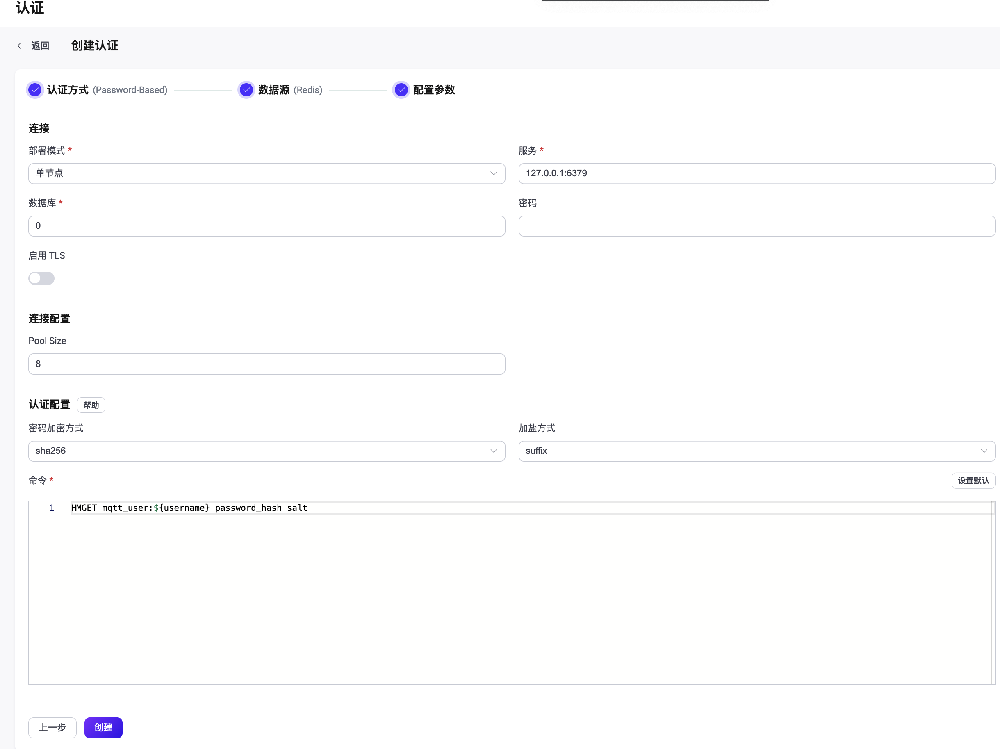

# 使用 Redis 进行密码认证

作为密码认证方式的一种，EMQX 支持通过集成 Redis 进行密码认证。EMQX 支持三种 Redis 部署模式：单节点、[Redis Sentinel](https://redis.io/docs/manual/sentinel/)、[Redis Cluster](https://redis.io/docs/manual/scaling/)，本节将介绍如何进行相关配置。

::: tip 前置准备：

- 熟悉 [EMQX 认证基本概念](../authn/authn.md)
:::

## 数据结构与查询指令

Redis 认证器支持使用 [Redis hashes](https://redis.io/docs/manual/data-types/#hashes) 存储认证数据，用户需要提供一个查询指令模板，且确保查询结果包含以下字段：

- `password_hash`: 必需，数据库中的明文或散列密码字段
- `salt`: 可选，为空或不存在时视为空盐（`salt = ""`）
- `is_superuser`: 可选，标记当前客户端是否为超级用户，默认为 `false`

添加我们希望添加一位名用户名为 `emqx_u`、密码为 `public`、盐值为 `slat_foo123`、散列方式为 `sha256` 且超级用户标志为 `true` 的用户：

```bash
>redis-cli
127.0.0.1:6379> HSET mqtt_user:emqx_u is_superuser 1 salt slat_foo123 password_hash 44edc2d57cde8d79c98145003e105b90a14f1460b79186ea9cfe83942fc5abb5
(integer) 0
```

对应的配置参数为：

- 密码加密方式：`sha256`
- 加盐方式：`suffix`
- 命令：`HMGET mqtt_user:${username} password_hash salt is_superuser`

::: tip
`password_hash` 这一字段名称直观表明用户应当在数据库中存储散列密码。但鉴于 Redis 没有类似 MySQL 的 `as` 语法，我们保留了 4.x 对 `password` 的兼容。

所以，我们也可以将 `cmd` 配置为 `HMGET mqtt_user:${username} password salt is_superuser`。
:::

## 通过 Dashboard 配置

在 [EMQX Dashboard](http://127.0.0.1:18083/#/authentication)页面，点击左侧导航栏的**访问控制** -> **认证**，在随即打开的**认证**页面，单击**创建**，依次选择**认证方式**为 `Password-Based`，**数据源**为 `Redis`，进入**配置参数**页签：



您可按照如下说明完成相关配置：

**连接**：在此部分完成到 Redis 数据库的连接设置。

- **部署模式**：选择 Redis 数据库的部署模式，可选值：**单节点**、**Sentinel**、**Cluster**
- **服务**（**列表**）：填入 Redis 服务器地址 (`host:port`) ；当部署模式选为 Sentinel 或 Cluster，您需在此提供所有相关 Redis 服务器的地址，不同地址之间以 `,` 分隔，格式为 `host1:port1,host2:port2,...`
- **Sentinel 名字**：指定 Redis Sentinel 配置需要的[主服务器名称](https://redis.io/docs/manual/sentinel/#configuring-sentinel)，仅需在**部署模式**设置为 **Sentinel** 时设置。
- **数据库**：整数，用于指定 Redis 数据库的 Index。
- **密码**（可选）：填入认证密码。

**TLS 配置**：配置是否启用 TLS。

**连接配置**：在此部分设置并发连接。

- **Pool size**（可选）：填入一个整数用于指定从 EMQX 节点到 Redis 数据库的并发连接数；默认值：**8**。

**认证配置**：在此部分进行认证加密算法相关的配置。

- **密码加密方式**：选择存储密码时使用的散列算法，如 plain、md5、sha、bcrypt、pbkdf2 等。
- 选择 **plain**、**md5**、**sha**、**sha256** 或 **sha512** 算法，需配置：
  - **加盐方式**：用于指定盐和密码的组合方式，除需将访问凭据从外部存储迁移到 EMQX 内置数据库中外，一般不需要更改此选项；可选值：**suffix**（在密码尾部加盐）、**prefix**（在密码头部加盐）、**disable**（不启用）。注意：如选择 **plain**，加盐方式应设为 **disable**。
- 选择 **bcrypt** 算法，无需额外配置。
- 选择 **pkbdf2** 算法，需配置：
  - **伪随机函数**：指定生成密钥使用的散列函数，如 sha256 等。
  - **迭代次数**：指定散列次数，默认值：**4096**。<!--后续补充取值范围-->
  - **密钥长度**（可选）：指定希望得到的密钥长度。如不指定，密钥长度将由**伪随机函数**确定。
- **命令**：Redis 查询命令

## 通过配置文件配置

您可通过配置文件完成相关配置，详细配置步骤请参考 [authn-redis:standalone](../../configuration/configuration-manual.md#authn-redis:standalone)、[authn-redis:sentinel](../../configuration/configuration-manual.md#authn-redis:sentinel) 与 [authn-redis:cluster](../../configuration/configuration-manual.md#authn-redis:cluster)。

以下为各部署模式下的配置文件示例：

:::: tabs type:card

::: tab 单节点

```hcl
{
  mechanism = password_based
  backend = redis
  enable = true

  redis_type = single
  server = "127.0.0.1:6379"

  password_hash_algorithm {
      name = sha256
      salt_position = suffix
  }

  cmd = "HMGET mqtt_user:${username} password_hash salt is_superuser"
  database = 1
  password = "public"
  auto_reconnect = true
}
```

:::

::: tab Redis Sentinel 部署模式

```hcl
{
  mechanism = password_based
  backend = redis
  enable = true

  redis_type = sentinel
  servers = "10.123.13.11:6379,10.123.13.12:6379"
  sentinel = "mymaster"

  password_hash_algorithm {
      name = sha256
      salt_position = suffix
  }

  cmd = "HMGET mqtt_user:${username} password_hash salt is_superuser"
  database = 1
  password = "public"
  auto_reconnect = true
}
```

:::

::: tab Redis Cluster 部署模式

```hcl
{
  mechanism = password_based
  backend = redis
  enable = true

  redis_type = cluster
  servers = "10.123.13.11:6379,10.123.13.12:6379"

  password_hash_algorithm {
      name = sha256
      salt_position = suffix
  }

  cmd = "HMGET mqtt_user:${username} password_hash salt is_superuser"
  database = 1
  password = "public"
  auto_reconnect = true
}
```

:::

::::
