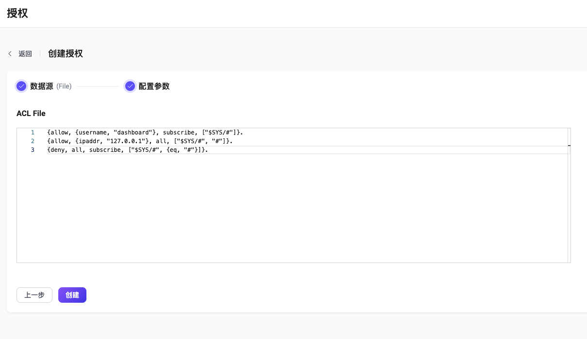

# 基于文件进行授权

EMQX 支持基于文件中存储的规则进行授权，您可通过配置文件配置权限列表。如需配置的规则非常多，建议采用基于数据库的方式进行授权。

::: tip
前置准备：

- 熟悉 [EMQX 授权基本概念](./authz.md)
:::

## 通过 Dashbard 配置

在 [EMQX Dashboard](http://127.0.0.1:18083/#/authentication) 页面，点击左侧导航栏的**访问控制** -> **授权**，在随即打开的**授权**页面，单击**创建**，选择**数据源**为 `File`，点击**下一步**，进入**配置参数**页签：



您可在 **ACL File** 区域编辑客户端访问规则，有关文件格式和对应字段的说明，可参考文件格式部分。<!--这里需要一个锚点到文件格式部分-->

<!--这里是不是可以给一段示例代码？-->

## 通过配置文件配置

您也可通过配置文件配置文件规则，具体操作步骤可以参考 [authz:file](../../configuration/configuration-manual.md#authz:file)。

文件 Authorizer 数据源类型 `type = file`。

示例：

```hocon
authorization {
  deny_action = ignore
  no_match = allow
  sources = [
    {
      type = file
      enable = true
      path = "etc/acl.conf"
    }
  ]
}
```

::: tip
默认 `path` 字段指定的文件对于 EMQX 是只读的。
如果通过 Dashboard 或 REST API 对权限进行过修改，EMQX 会把新的文件保存到 `data/authz/acl.conf`，并且之后不再读取原始配置中的文件。
:::

## 文件格式

基于文件进行授权前，您需要通过  Erlang  [元组](https://www.erlang.org/doc/reference_manual/data_types.html#tuple) 数据列表的形式将授权规则存储在文件中。基本语法如下：

- 元组是用花括号包起来的一个列表，各个元素用逗号分隔
- 每条规则后面必需有一个点号 `.`
- 以百分号开始的 `%` 行是注释，在解析过程中会被丢弃

示例：

```erlang
%% 允许用户名是 dashboard 的客户端订阅 "$SYS/#" 这个主题
{allow, {user, "dashboard"}, subscribe, ["$SYS/#"]}.

%% 允许来自127.0.0.1 的用户发布和订阅 "$SYS/#" 以及 "#"
{allow, {ipaddr, "127.0.0.1"}, pubsub, ["$SYS/#", "#"]}.

%% 拒绝其他所有用户订阅 "$SYS/#" 和 "#" 主题
{deny, all, subscribe, ["$SYS/#", {eq, "#"}]}.

%% 前面的规则都没有匹配到的话，允许所有操作
{allow, all}.
```

EMQX 将按照从上到下的顺序进行规则匹配遵，当一个规则匹配到当前客户端时，将返回允许或拒绝操作，后面的规则不再继续匹配。

在规则元组中：

第一个元素表示该条规则对应的权限；可选值：`allow`、`deny`

第二个元素用来指定哪些客户端适用此条规则，比如在以下示例中：

- `{username, "dashboard"}`：用户名是 `dashboard` 的客户端；也可写作`{user, "dashboard"}`；
- `{username, {re, "^dash"}}`：用户名匹配到[正则表达式](https://www.erlang.org/doc/man/re.html#regexp_syntax) `^dash` 的客户端
- `{clientid, "dashboard"}`：客户端 ID 为 `dashboard` 的客户端，也可写作`{client, "dashboard"}`
- `{clientid, {re, "^dash"}}`：客户端 ID 匹配到[正则表达式](https://www.erlang.org/doc/man/re.html#regexp_syntax) `^dash` 的客户端
- `{ipaddr, "127.0.0.1"}`：源 IP 地址是 `127.0.0.1` 的客户端。也可以使用 CIDR 地址格式。注意，如果 EMQX 部署在负载均衡器后侧，建议为 EMQX 的监听器开启 `proxy_protocol` 配置，否则 EMQX 可能会使用负载均衡器的源地址
- `{ipaddrs, ["127.0.0.1", ..., ]}`： 同上，但支持匹配多个源地址
- `all`：匹配所有客户端
- `{'and', First, Second}`： **与**操作，同时匹配 `First` 和 `Second` 两个规则
- `{'or', First, Second}`： **或**操作，匹配 `First` 或 `Second` 的其中一个即可

第三个元素用来指定该条规则对应的操作：

- `publish`：发布消息
- `subscribe`：订阅主题
- `all`：发布消息或订阅主题

第四个元素用于指定当前规则适用的 MQTT 主题或主题过滤器：

- `"$SYS/#"`：字符串，这是一个通用的主题过滤器（或通配符订阅），匹配规则与 [MQTT协议](http://docs.oasis-open.org/mqtt/mqtt/v3.1.1/errata01/os/mqtt-v3.1.1-errata01-os-complete.html#_Toc442180920)一致。例如，`$SYS/#` 可以为发布动作匹配到 `$SYS/foo` 和 `$SYS/foo/bar`，也可以为订阅动作匹配到`$SYS/foo`，`$SYS/foo/#`，和`$SYS/#`。支持[主题占位符](./authz.md#主题占位符)。
- `{eq, "foo/#"}`：表示不将该主题当作通配符来使用。该例子中，如果一个客户端订阅 `foo/#` 这个主题，这该规则匹配，而如果订阅的是主题是 `foo/bar` ，则匹配不到。

另外还有 2 种特殊的规则，通常会用在 ACL 文件的末尾作为默认规则使用。

- `{allow, all}`：允许所有请求

- `{deny, all}`：拒绝所有请求


