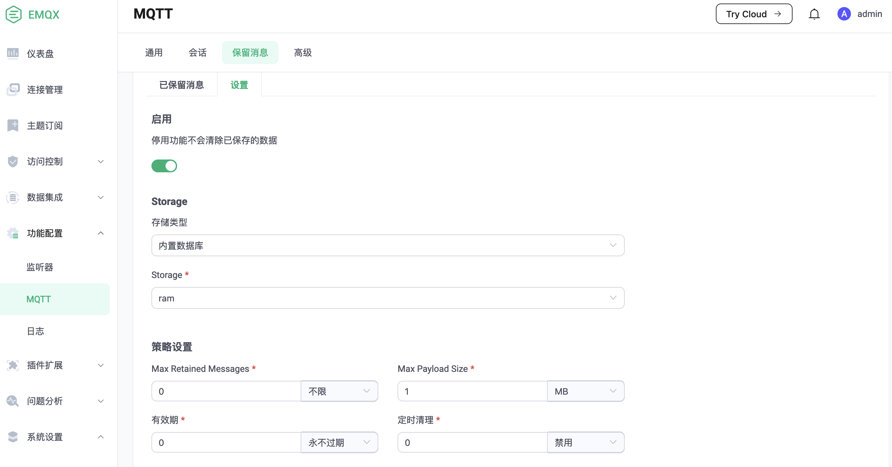

# 保留消息

## 简介

MQTT 服务端收到 Retain 标志为 1 的 PUBLISH 报文时，会将该报文视为保留消息，除了被正常转发以外，
保留消息会被存储在服务端，每个主题下只能存在一份保留消息，因此如果已经存在相同主题的保留消息，则该保留消息被替换。

当客户端建立订阅时，如果服务端存在主题匹配的保留消息，则这些保留消息将被立即发送给该客户端。
借助保留消息，新的订阅者能够立即获取最近的状态，而不需要等待无法预期的时间，这在很多场景下是非常重要的。

EMQX 默认开启保留消息的能力和服务，可以在 `etc/emqx.conf` 中修改 `mqtt.retain_available` 为 `false` 来关闭保留消息的能力，
这样客户端将被禁止发送 Retain 标志为 1 的 PUBLISH 报文，否则，客户端将会收到原因码为 0x9A（不支持保留消息）的 DISCONNECT 报文。

保留消息的服务会存储和管理客户端发送的保留消息，并发送给相应的订阅者。

## 保留消息服务

### 设置

打开 Dashboard，选择 `功能配置` 中的 `MQTT` 项，然后选择 `保留消息` 页面中的 `设置` 栏即可

## 配置

| 配置项                         | 类型     | 可取值                   | 默认值 | 说明                                                         |
| ------------------------------ | -------- | ------------------------ | ------ | ------------------------------------------------------------ |
| 存储方式       | enum     | `ram`, `disc`| ram |ram：仅储存在内存中； disc：储存在内存和硬盘中。|
| 最大存储条数 | integer  | \>= 0                    | 0      | 保留消息的最大数量，0 表示没有限制。保留消息数量超出最大值限制后，可以替换已存在的保留消息，但不能为新的主题储存保留消息。 |
| 最大存储大小      | bytesize |     | 1MB    | 保留消息的最大 Payload 值。Payload 大小超出最大值后 EMQ Ｘ 消息服务器会把收到的保留消息作为普通消息处理。 |
| 有效期       | duration |       | ０     | 保留消息的过期时间，0 表示永不过期。如果 PUBLISH 报文中设置了消息过期间隔，那么以 PUBLISH 报文中的消息过期间隔为准。 |
| 定时清理       | duration |       | ０     | 清理回收过期消息的间隔时间。 |

<!---

TODO wait new limiter

## 流控

The message read and deliver rate can be controlled.
When a client subscribes to a wildcard topic, it may match a large number of topics having messages retained.
Without flow control, the all matched messages will be copied into the subscriber's process memory space,
this may cause the subscriber Erlang process (the actor) to allocate excessive amount of RAM and risk at
shutdown forced by the `force_shutdown` policy.

To make it less aggressive, `retainer.flow_control` settings can be used.
The processing flow is as follows:

1. Load `batch_read_number` of retained message from the retainer storage
1. Deliver `batch_deliver_number` of messages
1. Repeat, until all retained messages are delivered

You may find more detailed information from configuration documents.
-->
