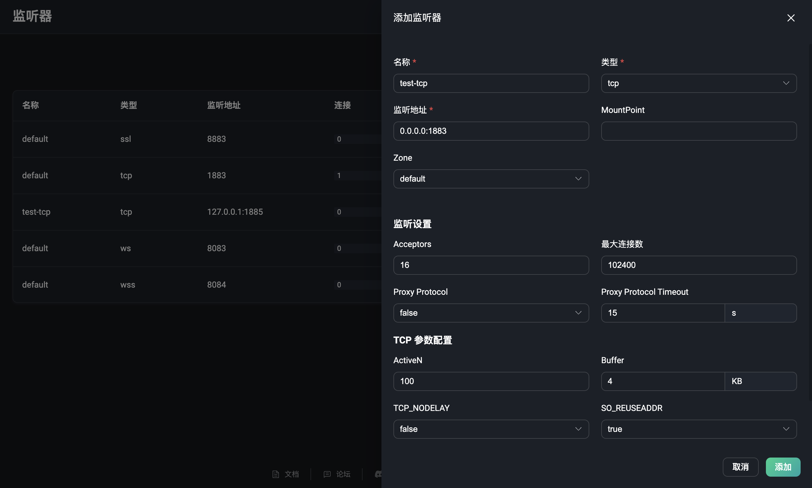
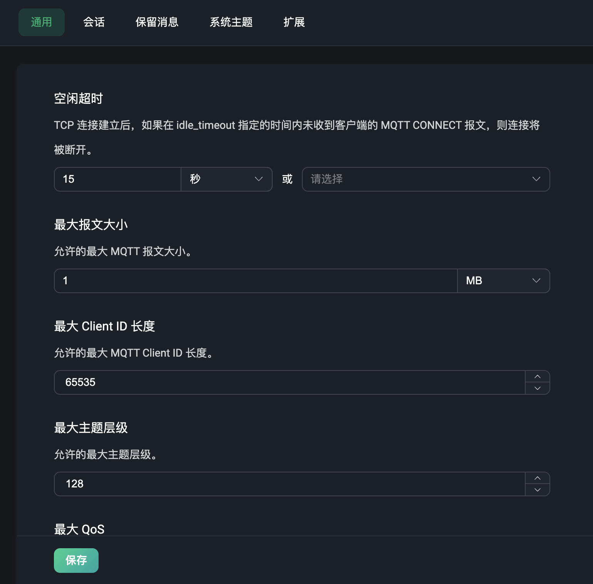
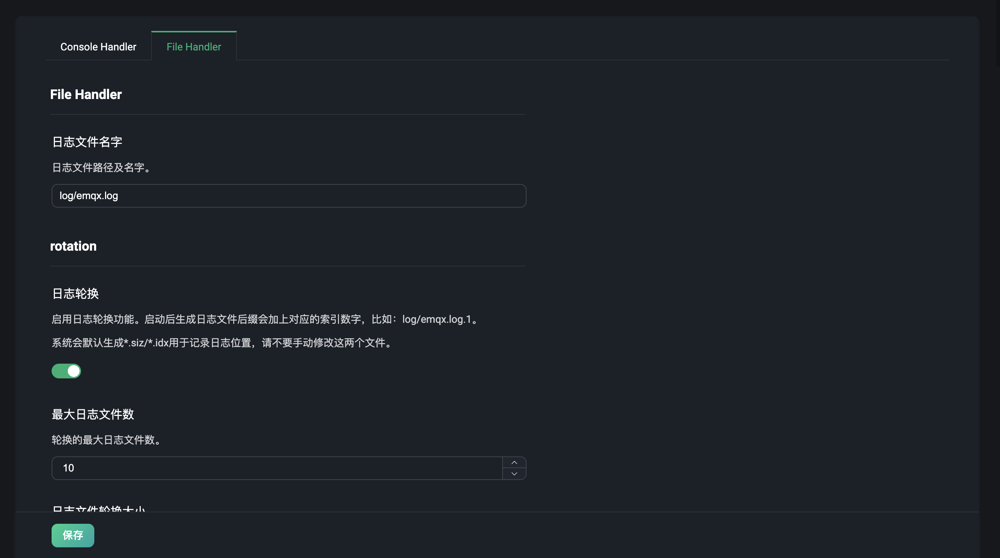
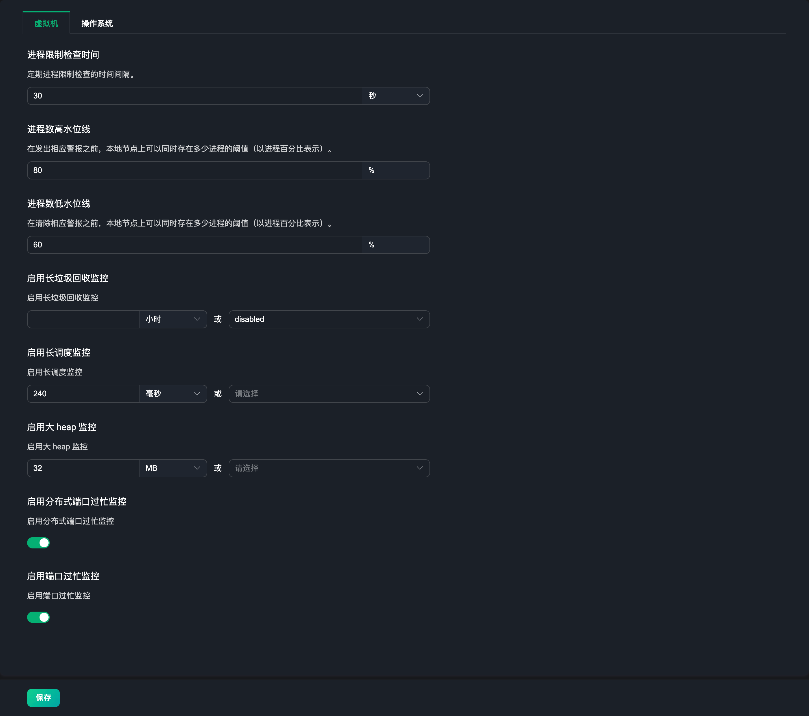
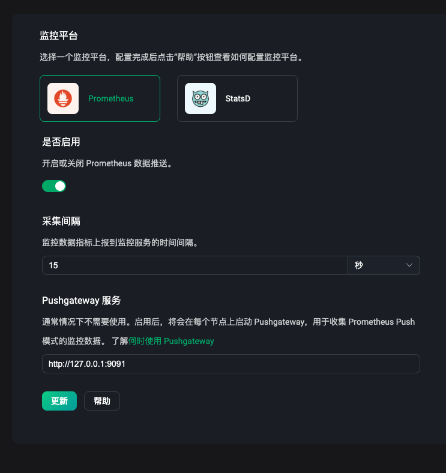

# 功能配置

EMQX 提供了热配置能力，可以在运行时动态修改配置，无需重启 EMQX 节点。在 Dashboard 页面中，我们针对热配置功能，提供了一个可视化配置页面，通过该页面，可以方便的修改 EMQX 的配置。目前提供了以下配置项：

- 监听器配置
- MQTT 配置
- 日志配置
- 监控集成配置

## 监听器

点击左侧配置菜单下的监听器，可以来到监听器页面，该页面默认是一个监听器的列表页。EMQX 默认提供了四个常用的监听器：

- 使用 1883 端口的 TCP 类型监听器
- 使用 8883 端口的 SSL/TLS 安全连接类型监听器
- 使用 8083 端口的 WebSocket 类型监听器
- 使用 8084 端口的 WebSocket 安全类型监听器

正常我们使用以上默认的监听器，输入对应端口和协议类型即可。如果需要添加其他类型的监听器，可以点击右上角的`添加监听器`按钮，添加一个新的监听器。

### 添加监听器

点击添加监听器按钮后，可以在右边的面板中看到一个添加监听器的表单，表单中包含了监听器的基本配置项，输入一个监听器名称用于标识该监听器，选择一个监听器类型，包括 tcp、ssl、ws 和 wss 类型，输入监听器地址，可以输入 IP 地址和端口号，使用 IP 地址可以限制监听器的访问范围，也可以直接输入一个端口号，然后点击`添加`按钮即可。

更多关于监听器配置的详情，请参考[监听器配置](../admin/cfg.md#brokerlisteners)。

### 管理监听器

添加完成一个监听器后，可以在列表中看到该监听器，可以点击`设置`按钮来修改该监听器的配置。注意：监听器名称、类型和监听地址不可在设置中再次修改。同样点击`删除`按钮，可以删除该监听器。当删除监听器时，需要输入目前正在删除的监听器名称，以确认删除操作。列表中我们还可以点击启用开关来启用或者禁用该监听器。列表中还可以查看每个监听器下的连接数。

::: warning
修改和删除监听器是一个带有危险性的操作，需要谨慎操作。如果更新或删除了一个监听器，那么该监听器上的客户端连接将会被断开。
:::

## MQTT

点击左侧配置菜单下的 MQTT，可以来到 MQTT 协议相关的配置页面。在 MQTT 配置页面中，我们可以配置 MQTT 协议相关的配置项，包括：

### 通用

通用菜单下为 MQTT 协议的通用基础配置项，包括类似于配置空闲超时，最大报文大小，最大 Client ID 长度，主题层级和 QoS 等级等配置项。

### 会话

会话菜单下为 MQTT 协议的会话相关配置项，包括会话过期间隔（仅支持非 MQTT 5.0 连接，MQTT 5.0 连接需在客户端配置），最大订阅数量，最大飞行窗口，是否存储QoS 0 消息等相关配置。

### 保留消息

保留消息菜单下为 MQTT 协议的保留消息相关配置项，最大保留消息数量，保留消息的存储类型等相关配置。还可以查看目前 EMQX 中的保留消息，在保留消息列表中查看该消息的主题，QoS，来自于哪个客户端 ID，发布时间，点击还可查看具体的 Payload 内容等信息。

### 高级

高级菜单下为 MQTT 协议的高级配置项，系统主题 $SYS 的配置，包括消息发布周期，心跳周期等。主题重写，可以手动添加需要重写的主题，动作，原始主题及目标主题。代理订阅，添加代理订阅的内置规则。最后可以设置延迟发布功能。

更多关于 MQTT 详细的配置文档，请参考 [MQTT 配置](../admin/cfg.md#brokermqtt)。

## 日志

点击左侧配置菜单下的日志，可以来到日志相关的配置页面。日志配置分为两个部分，一个是控制台日志，一个是文件日志，即 Console Handler 和 File Handler。在日志配置页面中，可以设置是否启用日志处理进程，设置日志级别，日志格式类型，text 还是 json，文件日志还可以设置日志文件的路径和日志名称。

更多关于日志详细的配置文档，请参考[日志配置](../admin/cfg.md#log)。

## 监控

点击左侧配置菜单下的监控，可以来到监控集成的配置页面。该菜单页面下包含有两个标签页：

- 系统：根据用户需要，针对[告警](./diagnose.md/#告警)功能进行一定程度的设置调整，如告警阈值、检查间隔等。
- 监控集成：提供了与第三方监控平台的集成配置。

### 系统

如当前告警触发阈值或告警监控检查间隔的默认值不符合用户的实际需要，可以在此页面进行设置调整。当前设置分为两个模块：`虚拟机`和`操作系统`，各配置项的默认值和说明可查看[告警](../observability/alarms.md)。

### 监控集成

该页面主要是提供了与第三方监控平台的集成配置，目前 EMQX 提供了与 Prometheus 与 StatsD 的集成方式。配置页面可以快速开启该配置，并配置推送数据地址与数据上报时间间隔等。

::: tip
注意，配置页面中存在一个二选一的配置项组件，可以输入一个自定义值，也可以选择提供的一个固定选项，两种方式只能选择其中一种。
:::
