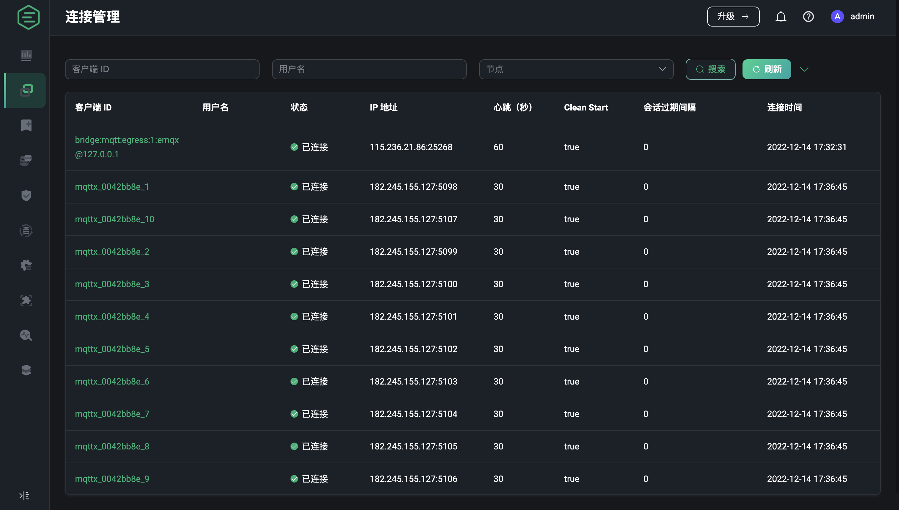
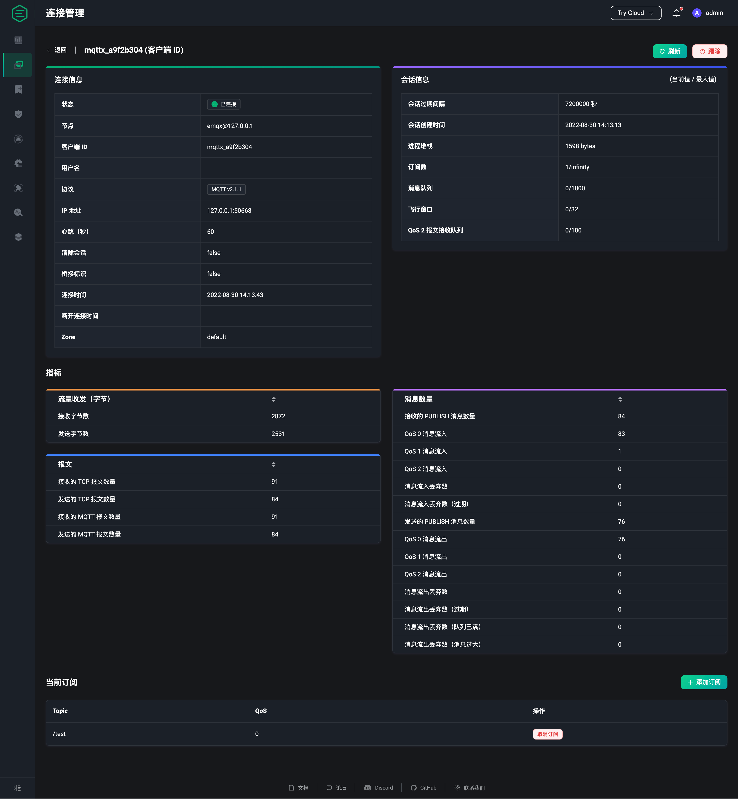

# 连接管理

用户可在管理连接中，查看当前连接至服务器或会话尚未过期的客户端及某一连接的详细信息和指标统计。可使用 [MQTT X](https://mqttx.app/zh) 作为客户端连接到 EMQX 进行发布订阅。也可使用[各语言提供的客户端库](https://www.emqx.io/docs/zh/v5.0/development/client.html)快速实现客户端连接至 EMQX。

## 连接管理列表

在连接管理列表中，用户可查看当前接入服务器或会话尚未过期的的连接列表及连接的基本信息，列表将展示各客户端连接到 EMQX 时设置的 ID 及用户名，当前的连接状态，客户端的 IP 地址，连接设置的心跳时长即连接最大空闲时长，还有关于连接会话的信息，包括是否清除会话及会话过期间隔，客户端连接至 EMQX 的时间；其中客户端的 IP 地址数据由客户端的 IP 地址及客户端连接到 EMQX 时使用的客户端的端口拼接而成。

默认状态下页面过滤条件字段只显示客户端 ID、用户名和节点，点击搜索栏右侧箭头按钮可展示所有可用于过滤的条件字段；可使用客户端 ID 和用户名进行模糊搜索以对连接列表进行过滤，也可选择连接所属的节点，连接状态或连接的时间范围对列表进行过滤，或者精确输入连接客户端的 IP 过滤目标 IP 地址的客户端，点击刷新按钮可重置所有过滤条件并重新加载连接列表。

## 连接详情

在连接管理列表页面，选择某一连接，点击客户端 ID 可进入该连接的连接详情页面。

连接详情页面的顶部可以手动刷新该连接的连接信息，以及查看该连接的连接指标统计，也可以手动剔除或清除该连接。

在连接详情页面中，除了已经在列表页面中显示的连接基本信息外，还提供了一些更详细的信息供用户查看，如使用的连接使用的协议版本、结束连接后是否清除会话等，如果是状态为已断开的连接，还将显示上次断开连接的时间；连接信息的右侧展示了该连接的会话信息，包括会话过期间隔、会话创建时间、进程堆栈、订阅数、消息队列长度、飞行窗口长度和 QoS2 报文接收队列长度。

连接信息下方根据流量收发、报文和消息数量三个类别展示了当前连接的统计指标，用户可根据需要进行查看。

详情页面底部显示了当前连接已订阅的主题，用户可点击添加订阅按钮，进行较为简单的订阅操作，或在订阅列表中点击取消订阅按钮，取消当前订阅的某个主题。

