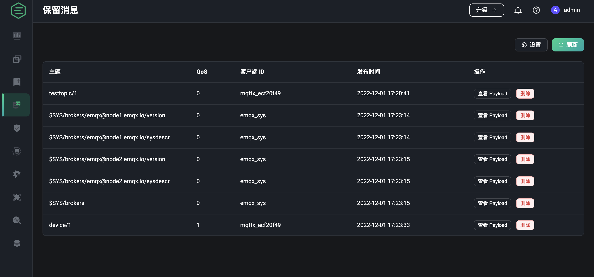
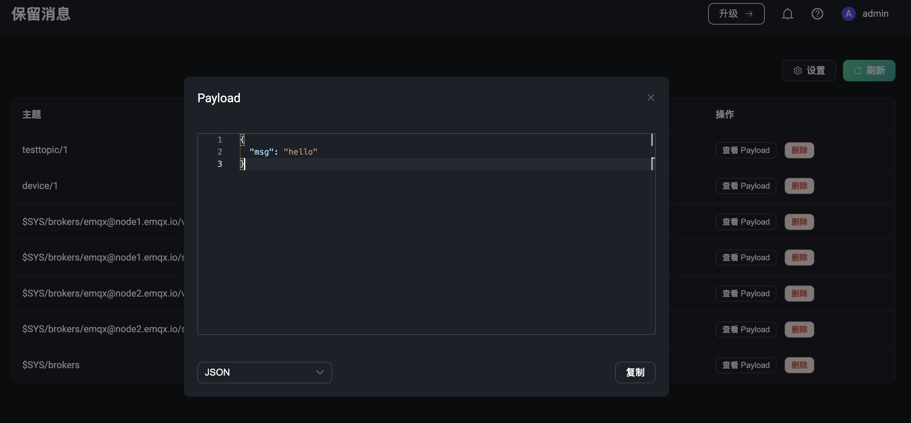

# 保留消息

点击左侧的保留消息菜单，可以来到保留消息的列表页面。保留消息列表页面可以查看当前系统中所有的保留消息。

当用户发布了一条保留消息时，EMQX 会将这条消息保存在系统中，用户可以在当前保留消息列表页面查看到这条消息。当用户订阅了这条保留消息的主题时，EMQX 会将这条消息发送给用户。保留消息的有效期默认为永不过期，除非用户手动删除这条消息。

## 保留消息列表

在保留消息列表页面，用户可以查看当前系统中所有的保留消息。列表内包含了保留消息的主题、保留消息的质量等级 QoS、发布保留消息的时间、还有发布该保留消息的客户端 ID。在列表中，用户还可以点击「查看 Pyalod」和「删除」按钮来查看保留消息的 Payload 和删除一条保留消息。点击列表右上角的 「刷新」按钮可以刷新当前保留消息列表，点击「设置」按钮可以跳转到保留消息的设置页面。

EMQX 默认将保存三类系统主题的保留消息，如果是集群环境，将根据不同的节点名称保存不同系统主题下的保留消息。其分别是：

- $SYS/brokers/+/sysdescr - 当前 EMQX 节点的系统描述
- $SYS/brokers/+/version - 当前 EMQX 节点的版本号
- $SYS/brokers - 当前 EMQX 所有的节点数量及名称

### 删除保留消息

通常情况下，用户可以在客户端中删除保留消息，方法是向保留消息的主题发布一条空消息。除此之外，用户也可以到 EMQ X Dashboard 中删除保留消息，在保留消息列表页面中点击「删除」按钮来删除一条保留消息。用户还可以在保留消息的配置页面中，设置保留消息的有效期，即过期时间，当保留消息过期后，EMQX 会自动删除这条保留消息。

## 查看 Payload

在保留列表中，用户仅能查看到保留消息的主题、时间、还有发布该保留消息的客户端 ID 等信息。如果用户想要查看保留消息的 Payload，可以在保留消息的列表页中点击「查看 Payload」按钮来查看保留消息的 Payload。

点击后，可以在弹窗中查看到保留消息的具体的 Payload 内容，在弹窗中，用户还可以点击「复制」按钮来快速复制保留消息的 Payload，点击左下角，还可以对 Payload 进行格式化输出，这对于一些特殊的 Payload 格式，如 JSON 或 Hex 格式的，可以更加直观的查看。

## 设置保留消息

在保留消息列表页面，点击右上角的「设置」按钮，可以快速跳转到配置页面中修改保留消息的配置。在配置页面中可以查看到当前保留消息的配置信息，包括保留消息的最大数量、保留消息的过期时间等。具体请访问[保留消息配置](./configuration.md#保留消息)。

:::tip
当保留消息功能被关闭时，EMQ X Dashboard 会在保留消息列表页面中显示「启动」按钮，并提示保留消息功能已被禁用，可点击跳转到配置页面中打开。
:::
