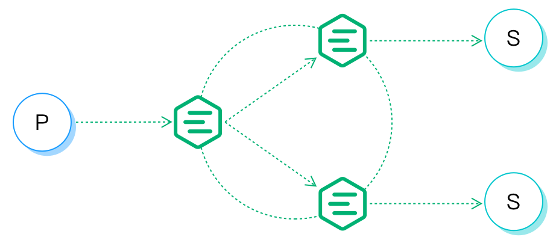

---
# 编写日期
date: 2020-02-07 17:15:26
# 作者 Github 名称
author: wivwiv
# 关键字
keywords:
# 描述
description:
# 分类
category: 
# 引用
ref:
---

# 架构设计

## 前言

EMQX 在设计上，首先分离了前端协议 (FrontEnd) 与后端集成 (Backend)，其次分离了消息路由平面 (Flow
Plane) 与监控管理平面 (Monitor/Control Plane):

### 100 万连接

多核服务器和现代操作系统内核层面，可以很轻松支持 100 万 TCP 连接，核心问题是应用层面如何处理业务瓶颈。

EMQX 在业务和应用层面，解决了单节点承载100万连接的各类瓶颈问题。连接测试的操作系统内核、TCP 协议栈、Erlang
虚拟机参数参见: [系统调优](../tutorial/tune.md)。

### 全异步架构

EMQX 是基于 Erlang/OTP 平台的全异步的架构：异步 TCP
连接处理、异步主题 (Topic) 订阅、异步消息发布。只有在资源负载限制部分采用同步设计，比如
TCP 连接创建和 Mnesia 数据库事务执行。

EMQX 3.0 版本中，一条 MQTT 消息从发布者 (Publisher) 到订阅者 (Subscriber)，在 EMQX
Broker 内部异步流过一系列 Erlang 进程 Mailbox:

### 消息持久化

EMQX 开源产品不支持服务器内部消息持久化，这是一个架构设计选择。首先，EMQX
解决的核心问题是连接与路由；其次，我们认为内置持久化是个错误设计。

传统内置消息持久化的 MQ 服务器，比如广泛使用的 JMS 服务器
ActiveMQ，几乎每个大版本都在重新设计持久化部分。内置消息持久化在设计上有两个问题:

1.  如何权衡内存与磁盘的使用？消息路由是基于内存的，而消息存储是基于磁盘的。
2.  多服务器分布集群架构下，如何放置 Queue 如何复制 Queue 的消息？

Kafka 在上述问题上，做出了正确的设计：一个完全基于磁盘分布式 Commit Log 的消息服务器。

EMQX 在设计上分离消息路由与消息存储职责后，数据复制容灾备份甚至应用集成，可以在数据层面灵活实现。

EMQX 企业版产品中，可以通过规则引擎或插件的方式，持久化消息到
Redis、MongoDB、Cassandra、MySQL、PostgreSQL 等数据库，以及 RabbitMQ、Kafka
等消息队列。

## 系统架构

### 概念模型

EMQX 概念上更像一台网络路由器 (Router) 或交换机 (Switch)，而不是传统的企业级消息队列 (MQ)。相比网络路由器按
IP 地址或 MPLS 标签路由报文，EMQX 按主题树 (Topic Trie) 发布订阅模式在集群节点间路由 MQTT 消息:

### 设计原则

1. EMQX 核心解决的问题：处理海量的并发 MQTT 连接与路由消息。
2. 充分利用 Erlang/OTP 平台软实时、低延时、高并发、分布容错的优势。
3. 连接 (Connection)、会话 (Session)、路由 (Router)、集群 (Cluster) 分层。
4. 消息路由平面 (Flow Plane) 与控制管理平面 (Control Plane) 分离。
5. 支持后端数据库或 NoSQL 实现数据持久化、容灾备份与应用集成。

### 系统分层

1. 连接层 (Connection Layer)：负责 TCP 连接处理、 MQTT 协议编解码。
2. 会话层 (Session Layer)：处理 MQTT 协议发布订阅消息交互流程。
3. 路由层 (Route Layer)：节点内路由派发 MQTT 消息。
4. 分布层 (Distributed Layer)：分布节点间路由 MQTT 消息。
5. 认证与访问控制 (ACL)：连接层支持可扩展的认证与访问控制模块。
6. 钩子 (Hooks) 与插件 (Plugins)：系统每层提供可扩展的钩子，支持插件方式扩展服务器。

## 连接层设计

连接层处理服务端 Socket 连接与 MQTT 协议编解码：

1. 基于 [eSockd](https://github.com/emqx/esockd) 框架的异步 TCP 服务端
2. TCP Acceptor 池与异步 TCP Accept
3. TCP/SSL, WebSocket/SSL 连接支持
4. 最大并发连接数限制
5. 基于 IP 地址 (CIDR) 访问控制
6. 基于 Leaky Bucket 的流控
7. MQTT 协议编解码
8. MQTT 协议心跳检测
9. MQTT 协议报文处理

## 会话层设计

会话层处理 MQTT 协议发布订阅 (Publish/Subscribe) 业务交互流程：

1. 缓存 MQTT 客户端的全部订阅 (Subscription)，并终结订阅 QoS
2. 处理 QoS 0/1/2 消息接收与下发，消息超时重传与离线消息保存
3. 飞行窗口 (Inflight Window)，下发消息吞吐控制与顺序保证
4. 保存服务器发送到客户端的，已发送未确认的 QoS 1/2 消息
5. 缓存客户端发送到服务端，未接收到 PUBREL 的 QoS 2 消息
6. 客户端离线时，保存持久会话的离线 QoS 1/2 消息

### 报文 ID 与消息 ID

MQTT 协议定义了一个 16bits 的报文 ID (PacketId)，用于客户端到服务器的报文收发与确认。MQTT
发布报文 (PUBLISH) 进入 Broker 后，转换为一个消息对象并分配 128bits 消息 ID (MessageId)。

全局唯一时间序列消息 ID 结构:

1. 64bits 时间戳: erlang:system_time if Erlang \>= R18, otherwise os:timestamp
2. Erlang 节点 ID: 编码为2字节
3. Erlang 进程 PID: 编码为4字节
4. 进程内部序列号: 2字节的进程内部序列号

端到端消息发布订阅 (Pub/Sub) 过程中，发布报文 ID 与报文 QoS 终结在会话层，由唯一 ID 标识的 MQTT 消息对象在节点间路由:

## 路由层设计

路由层维护订阅者 (Subscriber) 与订阅关系表 (Subscription)，并在本节点发布订阅模式派发 (Dispatch) 消息:

消息派发到会话 (Session) 后，由会话负责按不同 QoS 送达消息。

## 分布层设计

分布层维护全局主题树 (Topic Trie) 与路由表 (Route Table)。主题树由通配主题构成，路由表映射主题到节点:

分布层通过匹配主题树 (Topic Trie) 和查找路由表 (Route Table)，在集群的节点间转发路由 MQTT 消息:

## Mnesia/ETS 表设计

| Table                      | Type   | Description   |
| -------------------------- | ------ | ------------- |
| emqx_conn                  | ets    | 连接表           |
| emqx_metrics               | ets    | 统计表           |
| emqx_session               | ets    | 会话表           |
| emqx_hooks                 | ets    | 钩子表           |
| emqx_subscriber            | ets    | 订阅者表          |
| emqx_subscription          | ets    | 订阅表           |
| emqx_admin                 | mnesia | Dashboard 用户表 |
| emqx_retainer              | mnesia | Retained 消息表  |
| emqx_shared_subscription   | mnesia | 共享订阅表         |
| emqx_session_registry      | mnesia | 全局会话注册表       |
| emqx_alarm_history         | mnesia | 告警历史表         |
| emqx_alarm                 | mnesia | 告警表           |
| emqx_banned                | mnesia | 禁止登陆表         |
| emqx_route                 | mnesia | 路由表           |
| emqx_trie                  | mnesia | Trie 表        |
| emqx_trie_node             | mnesia | Trie Node 表   |
| mqtt_app                   | mnesia | App 表         |

## Erlang 设计相关

1. 使用 Pool, Pool, Pool... 推荐 GProc 库: <https://github.com/uwiger/gproc>
2. 异步，异步，异步消息...连接层到路由层异步消息，同步请求用于负载保护
3. 避免进程 Mailbox 累积消息
4. 消息流经的 Socket 连接、会话进程必须 Hibernate，主动回收 binary 句柄
5. 多使用 Binary 数据，避免进程间内存复制
6. 使用 ETS, ETS, ETS... Message Passing vs. ETS
7. 避免 ETS 表非键值字段 select, match
8. 避免大量数据 ETS 读写, 每次 ETS 读写会复制内存，可使用 lookup_element, update_counter
9. 适当开启 ETS 表 {write_concurrency, true}
10. 保护 Mnesia 数据库事务，尽量减少事务数量，避免事务过载(overload)
11. 避免对 Mnesia 数据表非索引、或非键值字段 match, select

