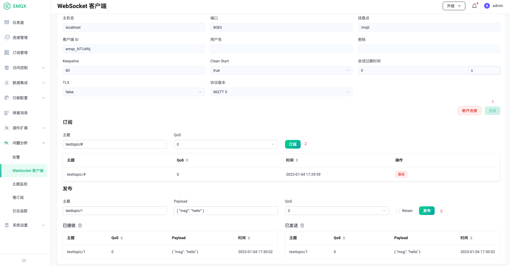

# 快速开始

作为全球最具扩展性的 MQTT 消息服务器，EMQX 提供了高效可靠海量物联网设备连接，能够高性能实时移动与处理消息和事件流数据，帮助您快速构建关键业务的物联网平台与应用。

本章节将带您从下载安装开始，带您体验从启动 EMQX 服务，到通过 WebSocket 工具或 MQTT 客户端测试连接并进行消息发布订阅的完整流程。

::: tip
除了私有部署外，我们也提供了全托管的 EMQX Cloud 服务，您只需几步注册即可轻松体验 EMQX 提供的 MQTT 消息服务，欢迎前往 [EMQX Cloud 门户](https://cloud.emqx.com/)页面免费试用。
:::

## 版本选择


EMQX 目前提供开源和企业版两个版本，您可根据需要点击下方链接下载对应版本：

- [开源版](https://www.emqx.com/zh/try?product=broker)
- [企业版](https://www.emqx.com/zh/try?product=enterprise)



:::: tabs type:card


::: tab EMQX 开源版
大规模可弹性伸缩的云原生分布式物联网 MQTT 消息服务器，高效可靠连接海量物联网设备，高性能实时处理消息与事件流数据，助力构建关键业务的物联网平台与应用。

- 基于 APL 2.0 开放源码协议
- 完整 MQTT 3.1.0、3.1.1 和 5.0 规范，支持 MQTT-SN
- Masterless 高可用集群架构
- 高并发、低时延、高性能
- 可扩展的网关和插件体系

[下载安装](https://www.emqx.io/zh/downloads)
:::


::: tab EMQX 企业版

**「随处运行，无限连接，任意集成」** 云原生分布式物联网接入平台，一体化的分布式 MQTT 消息服务和强大的 IoT 规则引擎，为高可靠、高性能的物联网实时数据移动、处理和集成提供动力，助力企业快速构建关键业务的 IoT 平台与应用。

- 标准或专有多协议支持
- 基于 SQL 的 IoT 数据集成
- 数据持久化与数据桥接
- 管理与监控中心
- 7x24 小时技术支持服务

[**免费试用**](https://www.emqx.com/zh/try?product=enterprise)
:::

::::

## 安装 EMQX

EMQX 支持多种安装方式，比如[容器化部署](./deploy/install.md#通过-docker-运行-包含简单的-docker-compose-集群)，通过 [EMQX Kubernetes Operator](https://www.emqx.com/zh/emqx-kubernetes-operator) 安装部署、或通过安装包的形式部署在物理服务器或虚拟机上，针对安装包部署形式，目前我们支持以下操作系统：

- RedHat
- CentOS
- RockyLinux
- AmazonLinux
- Ubuntu
- Debian
- MacOS
- Windows
- Linux <!--后续在安装页面完成后，重新调整排序以及插入超链接-->

如您需要 FreeBSD、国产硬件平台以及操作系统适配（如麒麟、深度、红旗等）或其他 Linux 发行版安装包，可参考 [源码编译安装](./deploy/install.md#源码编译安装) 或 [联系我们](https://www.emqx.com/zh/contact) 获取支持。<!--后续在安装页面完成后，重新调整排序以及插入超链接-->

此外，您还可通过 [EMQX Terraform](https://www.emqx.com/zh/emqx-terraform) 在主流公有云上一键部署包含 EMQX Enterprise 集群在内的所有基础设施，如[阿里云](https://github.com/emqx/tf-alicloud)、[亚马逊云科技](https://github.com/emqx/tf-aws)。<!-- TODO @wivwiv Update K8s link when EMQX Terraform 5.0 document ready -->

### 快速安装启动

在本篇快速上手中，我们将带您通过容器化部署或解压安装的形式快速体验 EMQX。

:::: tabs type:card

::: tab 通过 Docker 容器运行

容器化部署是体验 EMQX 的最快方式，因此本节将以容器化部署为例，带您开始完整的 EMQX 使用旅程。 

1. 在命令行工具中输入如下命令，下载并运行最新版 EMQX：

```bash
docker run -d --name emqx -p 1883:1883 -p 8083:8083 -p 8084:8084 -p 8883:8883 -p 18083:18083 emqx/emqx:latest
```


运行此命令前，请确保 [Docker](https://www.docker.com/) 已安装且已启动。

2. 通过浏览器访问 [http://localhost:18083/](http://localhost:18083/)（localhost 可替换为您的实际 IP 地址）以访问 [EMQX Dashboard](./dashboard/introduction.md) 管理控制台，进行设备连接与相关指标监控管理。

   默认用户名及密码：
   
   `admin`
   
   `public`
   
   <!--后续补上 dashboard的截图-->

:::

::: tab 通过 zip/tar.gz 压缩包快速安装

您也可以选择通过 zip/tar.gz 压缩包的形式在本地进行安装部署，方便后续进行配置调整以及性能调优。本节我们将以 [macOS](https://www.emqx.io/zh/downloads?os=macOS) (macOS11 amd64) 为例演示如何下载并安装 EMQX。

由于手动安装过程中涉及比较多的依赖项目，因此推荐在测试或热升级环境中采用安装包方式，**不建议**在生产环境中使用。


1. 在命令行工具中输入如下命令，下载 zip 文件。

   ```
   wget https://www.emqx.com/zh/downloads/broker/5.0.13/emqx-5.0.13-macos11-amd64.zip
   ```

2. 通过以下命令安装 EMQX。

   ```
   mkdir -p emqx && unzip emqx-5.0.13-macos11-amd64.zip -d emqx
   ```

3. 运行以下命令启动 EMQX。

   ```
   ./emqx/bin/emqx start
   ```
   
4. 现在您可通过浏览器访问 [http://localhost:18083/](http://localhost:18083/)（localhost 可替换为您的实际 IP 地址）以访问 [EMQX Dashboard](./dashboard/introduction.md) 管理控制台，进行设备连接与相关指标监控管理。

   默认用户名及密码：
   
   `admin`
   
   `public`
   
5. 运行以下命令停止 EMQX。
   
   ```
   ./emqx/bin/emqx stop
   ```


后续如需卸载 EMQX，您可直接删除 EMQX 目录即可完成卸载。

:::

::::

接下来我们将通过 Dashboard 自带的 WebSocket 工具进行连接测试。

## 使用 Dashboard WebSocket 工具快速验证

EMQX 提供了标准的 MQTT 协议包括 MQTT over WebSocket 支持，启动后即可接入 MQTT 客户端，本节我们将演示如何通过 Dashboard 自带的 WebSocket 客户端工具接入 EMQX，从而进行消息通信验证。

在 Dashboard 页面，点击左侧导航栏的 **问题分析 -> WebSocket 客户端**，即可进入相关页面。您可按照如下步骤完成客户端与 EMQX 的连接、订阅相关主题，并测试消息的发送与接收情况。

1. 连接客户端与 EMQX。点击页面右侧的**连接**按钮，系统将提示当前客户端已成功连接。
2. 订阅相关主题。点击页面中部的**订阅**按钮，此时我们将订阅 `testtopic/#`主题下所有 QoS 为 0 的消息，您可以根据需要增加多个主题或测试其他 QoS 等级。
3. 测试消息的接收。点击页面底部的**发布**按钮，此时可以看到页面底部的已发送和已接收窗格各出现了一条消息，证明连接已成成功。





4. 此时我们通过点击左侧导航栏的**仪表盘**返回主界面，在**概览**页签，可以看到当前的连接数，主题数、以及订阅数，节点信息，以及实时的消息发送及接收情况。

<!-- TODO @wivwiv Update screenshot -->

如您希望进行更复杂的测试，比如单/双向 SSL 认证、通过自定义脚本模拟测试数据等，也可通过 [MQTTX 桌面客户端](https://mqttx.app/zh)进行更多测试。

## 进阶操作

<!-- TODO @wivwiv Update links after document is ready-->

至此，我们已经完成基本的 EMQX 安装、启动和接入测试，您还可以继续进行访问控制、集成第三方数据系统等操作。<!--后续添加相关连接-->

## 常见问题解答

您可以访问 [EMQ 问答社区](https://askemq.com/) 参与交流，提出、解答 EMQX 以及 EMQ 相关产品使用问题，与 EMQX 用户交流物联网相关技术的使用经验，此外也欢迎随时联系我们](https://www.emqx.com/zh/contact) 获取专业技术支持。
