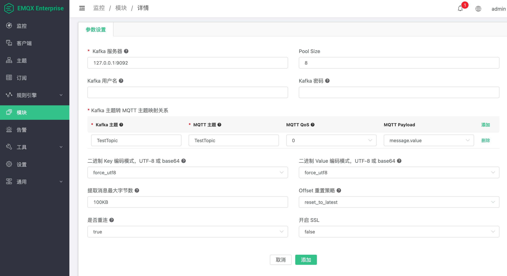

# Kafka 消费组

Kafka 消费组使用外部 Kafka 作为消息队列，可以从 Kafka 中消费消息转换成为 MQTT 消息发布在 emqx 中。

搭建 Kafka 环境，以 MacOS X 为例:

```bash
$ wget https://archive.apache.org/dist/kafka/2.3.1/kafka_2.12-2.3.1.tgz

$ tar -xzf  kafka_2.12-2.3.1.tgz

$ cd kafka_2.12-2.3.1

# 启动 Zookeeper
$ ./bin/zookeeper-server-start.sh config/zookeeper.properties
# 启动 Kafka
$ ./bin/kafka-server-start.sh config/server.properties
```

::: danger

Kafka消费组不支持Kafka0.9以下版本

创建资源之前，需要提前创建Kafka主题，不然会提示错误

:::

创建 Kafka 的主题:

```bash
$ ./bin/kafka-topics.sh --zookeeper localhost:2181 --replication-factor 1 --partitions 1 --topic testTopic --create
```

## 创建模块

打开 [EMQ X Dashboard](http://127.0.0.1:18083/#/modules)，点击左侧的 “模块” 选项卡，选择添加：


选择 Kafka 消费组模块:


填写相关参数:



1). Kafka 服务器地址

2). Kafka consumer 连接池大小

3). Kafka 的订阅主题

4). MQTT 的消息主题

5). MQTT 的主题服务质量

6). Kafka Max Bytes (每次从 Kafka 里消费消息的最大字节数)

7). Kafka Offset Reset Policy (重置Offset策略,reset_to_latest | reset_by_subdcriber)

7). Kafka consumer 是否重连

点击添加后，模块添加完成:


资源已经创建完成，现在用Dashboard的websocket工具订阅MQTT的主题 "TestTopic":


使用kafka 命令行 生产一条消息:

```bash
./bin/kafka-console-producer.sh --broker-list localhost:9092 --topic TestTopic
```


Dashboard的websocket工具接收到了Kafka 生产的消息"hello-kafka":

