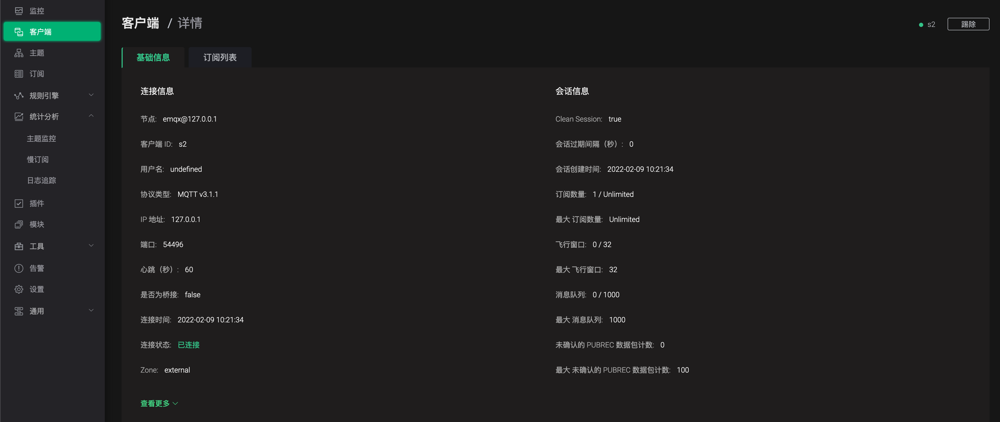

# Table of Contents

1.  [慢订阅统计](#org10c5186)
    1.  [创建模块](#org395e425)
    2.  [实现说明](#orgdd4d5d6)
        1.  [时延计算方法](#org693a7e9)
        2.  [平均时延计算方法](#org712747a)
    3.  [配置说明](#orgcd5b688)
    4.  [慢订阅记录](#orgb3ce581)

# 慢订阅统计

该功能按照消息传输的平均时延, 从高到低对订阅者进行排名

## 创建模块

打开 EMQX Dashboard，点击左侧的 “模块” 选项卡，选择添加：

选择 ****慢订阅统计**** 模块, 然后点击 *启动* 即可

## 实现说明

该功能会追踪QoS1和QoS2消息到达EMQX后,完成消息传输全流程的时间消耗,然后采用指数移动平均算法,计算该订阅者的平均消息传输
时延,之后按照时延高低对订阅者进行统计排名

同时, 因为QoS1和QoS2消息可能因为各种原因,导致无法完成传输流程,所以该功能也会在消息传输超时后,根据超时时间尝试将订阅者
加入到排名中

注意:为了避免性能开销,进行统计排名的最低时延为100ms

### 时延计算方法

-   QoS1
    从 *publish* 消息到到EMQX内时开始计算, 直到EMQX收到 *puback* 为止
-   QoS2
    从 *publish* 消息到到EMQX内时开始计算, 直到EMQX收到 *pubcomp* 为止

### 平均时延计算方法

平均时延采用[指数移动平均算法](https://en.wikipedia.org/wiki/Moving_average#Exponential_moving_average)对每次消息的传输时延进行加权计算,避免了单次抖动或者历史极值对平均值的影响.

采样数的配置为 *`emqx.zone.latency_samples`*, 在 *emqx.conf* 配置中

该值最小值为1,为1时将会忽略所有历史值,这将导致无法避免单次传输抖动对结果的影响,不建议这样做

而该值越大,历史值的影响也将会越来越大,如果过大,可能导致平均时延更新无法及时的反应出当前真实的时延

## 配置说明

-   时延阈值
    *时延阈值* 用来判断订阅者是否可以参与统计,如果订阅者的时延低于这个值,将不会进行统计
-   最大统计条数
    这个字段决定统计记录表中数量上限
-   有效时长
    *有效时长* 控制统计记录中每一条数据的有效时间,如果该数据在这个时间范围内,一直没有被更新过,将会被移除
    (比如发送一条消息后因为时延很长,被加入到统计记录中,之后长时间没有再次发送消息,在超过这个字段后,将会被清除掉)
-   推送间隔
    慢订阅统计的数据可以被推送到系统消息 *\(SYS/brokers/\){node}/slowsubs* 中, *推送间隔* 用来控制推送的时间间隔,如果设置
    为0, 则不会进行推送
-   推送QoS
    向系统消息进行推送时的QoS
-   推送批量数
    向系统消息进行推送采用的是分批模式,如果慢订阅统计数据很大,一次性全部推送,可能会导致堵塞,这个时候可以适当的减小这个值

## 慢订阅记录

这个标签页下会按照时延,从高到底依次显示订阅者信息,点击 *Client ID* 将会显示订阅者详情,可以通过订阅者详情来进行问题分析
和查找.

