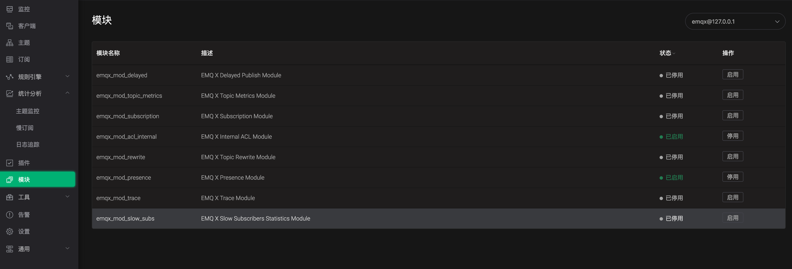

# 慢订阅统计

该功能按照消息传输的耗时, 从高到低对订阅者进行排名

## 开启模块

打开 EMQ X Dashboard，点击左侧的 “模块” 选项卡，选择添加：

选择 ****慢订阅统计**** 模块, 然后点击 *启动* 即可

## 实现说明

该功能会追踪 QoS1 和 QoS2 消息到达 EMQX 后, 完成消息传输全流程的时间消耗, 然后根据配置中的选项，计算消息的传输时延，
之后按照时延高低对订阅者、主题进行统计排名

## 配置说明

-   时延阈值/threshold

    *时延阈值* 用来判断订阅者是否可以参与统计, 如果订阅者的时延低于这个值, 将不会进行统计

-   最大统计条数/top\_k\_num

    这个字段决定统计记录表中数量上限

-   有效时长/expire\_interval

    *有效时长* 控制统计记录中每一条数据的有效时间, 如果该数据在这个时间范围内, 一直没有被更新过, 将会被移除
    (比如发送一条消息后因为时延很长, 被加入到统计记录中, 之后长时间没有再次发送消息, 在超过这个字段后, 将会被清除掉)

-   统计类型/stats\_type
    计算时延的方式，分别为:

    1.  whole

        从消息到达 EMQX 时起，直到消息完成传输时

    2.  internal

        从消息到达 EMQX 时起，直到 EMQX 开始投递消息时

    3.  response

        从 EMQX 开始投递消息时起，直到消息完成传输时

    消息完成传输的定义:

    1.  QoS0

        EMQX 开始投递时

    2.  QoS1

        EMQX 收到客户端的 *puback* 时

    3.  Qos2

        EMQX 收到客户端的 *pubcomp* 时

注意:开源版配置在emqx.conf中

## 慢订阅记录

这个标签页下会按照时延, 从高到底依次显示订阅者和主题信息, 点击 *Client ID* 将会显示订阅者详情, 可以通过订阅者详情来进行问题分析
和查找.

