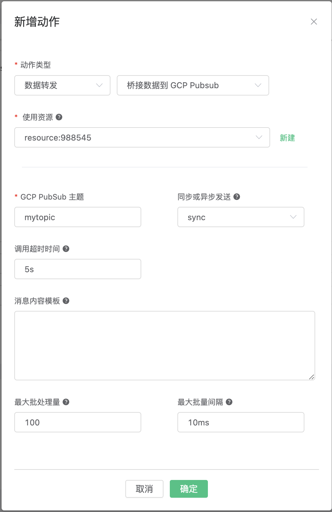

# 桥接数据到 GCP PubSub
从 EMQX Enterprise e4.4.11 开始，EMQX 的规则引擎支持 Google GCP PubSub 的数据桥接。

EMQX GCP PubSub 可以将 MQTT 客户端消息与事件发送到 [Google Cloud PubSub](https://cloud.google.com/pubsub?hl=zh-cn)，以便您灵活选择 Google Cloud 上的各类服务，更快地构建物联网应用。

以下步骤将引导您完成这一配置。

::: tip
在 `e4.4.11` 中引入。
:::

## 设置

1. 创建一个[服务账户](https://developers.google.com/identity/protocols/oauth2/service-account#creatinganaccount)，为服务账户分配合理的角色确保可以向指定的 PubSub 主题发布消息。
2. 为该账户创建一个服务账户密钥，并下载 JSON 格式的账户文件。
3. 创建一个 PubSub 主题（服务账户必须有该主题的发布权限）。

## 创建 GCP PubSub 资源

转到 [EMQX Dashboard](http://127.g0.0.1:18083/#/resources)，
在左边的菜单上选择“规则引擎”项目，然后选择“资源”，点击“创建”。

在对话框中，选择 “GCP PubSub” 类型，并点击“选择文件”，上传 GCP 服务账户JSON 文件。

点击“确认”完成资源创建。


## 创建规则和动作

转到 [EMQX Dashboard](http://127.0.0.1:18083/#/resources)，选择左边菜单上的
“规则引擎”项目，然后选择“规则”，点击“创建”。

输入以下SQL。

```sql
SELECT
    *
FROM
    "t/gcp"
```


点击“添加动作”，选择动作类型为 “数据转发”->“桥接到 GCP PubSub”，在“使用资源”中选择 之前创建的 GCP PubSub 资源。
填入动作的参数。 这里唯一需要定义的参数是 PubSub Topic，即消息发送的目标，点击“确认”完成动作添加。



最后，点击页面底部的“创建”完成规则创建。

## 测试动作

你可以通过向 EMQX 发送一条 MQTT 消息进行测试。

```bash
Topic: "t/gcp"

QoS: 0

Retained: false

Payload: "hello"
```

查看该规则的统计指标是否增长：


从 PubSub 主题中订阅消息，验证数据是否被转发到 GCP：

```bash
# 为你的主题创建一个订阅
gcloud pubsub subscriptions create my_subscription_id --topic=mytopic

# 从 PubSub 订阅消息
gcloud pubsub subscriptions pull my_subscription_id --auto-ack
```
