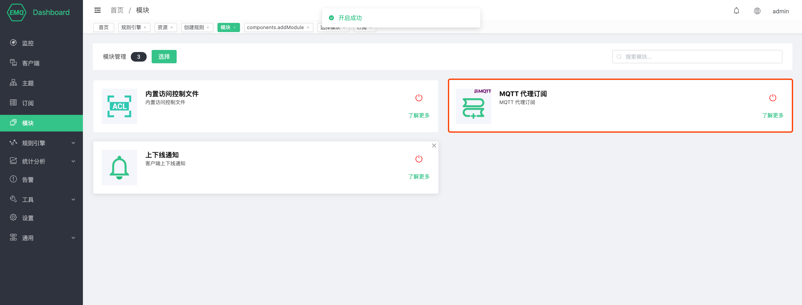

# 通过规则预设订阅关系

## 创建模块

打开 [EMQX Dashboard](http://127.0.0.1:18083/#/modules)，点击左侧的 “模块” 选项卡，选择添加：

选择 MQTT 代理订阅模块

配置相关参数

点击添加后，模块添加完成

## 订阅选项

+ 服务质量（ QoS ）

  服务端可以向客户端发送的应用消息的最大 QoS 等级。

+ NL（ No Local ）

  应用消息是否能够被转发到发布此消息的客户端。

  - NL 值为 0 时，表示应用消息可以被转发给发布此消息的客户端。

  - NL 值为 1 时，表示应用消息不能被转发给发布此消息的客户端。

+ RAP（ Retain As Published ）

  向此订阅转发应用消息时，是否保持消息被发布时设置的保留(RETAIN)标志。

  - RAP 值为 0 时，表示向此订阅转发应用消息时把保留标志设置为 0。

  - RAP 值为 1 时，表示向此订阅转发应用消息时保持消息被发布时设置的保留标志。

+ RH（ Retain Handling ）

  当订阅建立时，是否发送保留消息

  - 0：订阅建立时发送保留消息

  - 1：订阅建立时，若该订阅当前不存在则发送保留消息

  - 2：订阅建立时不要发送保留消息

## 代理订阅规则

在配置代理订阅的主题时，EMQX 提供了 `%c` 和 `%u` 两个占位符供用户使用，EMQX 会在执行代理订阅时将配置中的 `%c` 和 `%u` 分别替换为客户端的 `Client ID` 和 `Username`，需要注意的是，`%c` 和 `%u` 必须占用一整个主题层级。

例如，添加上文图中的规则后：配置 A、B 两个客户端，客户端 A 的 `Client ID` 为 `testclientA`，`Username` 为 `testerA`，客户端 B 的 `Client ID` 为 `testclientB`，`Username` 为 `testerB`。

A 客户端使用 MQTT V3.1.1 协议连接 EMQX，根据上文的配置规则，代理订阅功能会主动帮客户端订阅 QoS 为 1 的 `client/testclientA` 和 QoS 为 2 的 `user/testerA` 这两个主题，因为连接协议为 MQTT V3.1.1，所以配置中的 No Local、Retain As Published、Retain Handling 不生效。

B 客户端使用 MQTT V5 协议连接 EMQX，根据上文的配置规则，代理订阅功能会主动帮客户端订阅 `client/testclientB` 和 `user/testerB` 这两个主题，其中 `client/testclientB` 的订阅选项为 Qos = 1，No Local、Retain As Published、Retain Handling 均为 0；`user/testerB` 的订阅选项为 Qos = 2、No Local = 1、Retain As Published = 1 、Retain Handling = 1。